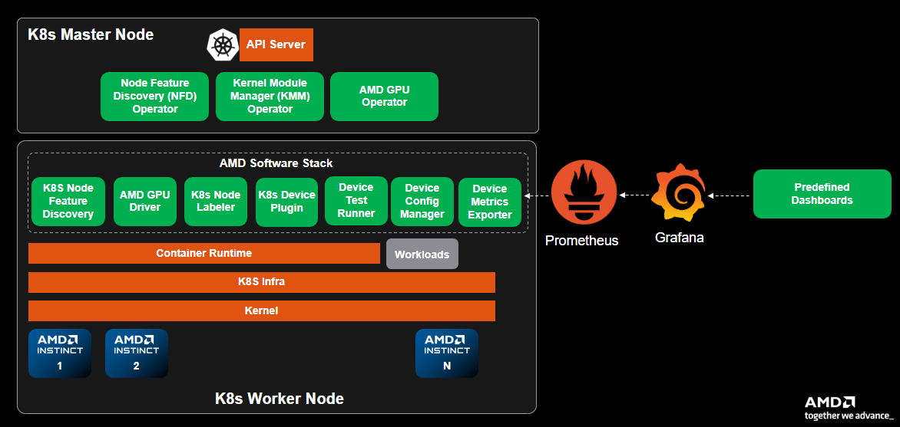

# Operator Overview

The AMD GPU Operator consists of several key components that work together to manage AMD GPUs in Kubernetes clusters. This document provides an overview of each component and its role in the system.

## Core Components

### Controller Manager

The AMD GPU Operator Controller Manager is the central control component that manages the operator's custom resources. Its primary responsibilities include:

- Managing the `DeviceConfig` custom resource
- Running reconciliation loops to maintain desired state
- Coordinating driver installation, upgrades, and removal
- Managing the lifecycle of dependent components (device plugin, node labeller, metrics exporter)

### Node Feature Discovery (NFD)

The [Node Feature Discovery (NFD)](https://github.com/kubernetes-sigs/node-feature-discovery) component automatically detects and labels nodes with AMD GPU hardware. Key features include:

- Detection of AMD GPUs using PCI vendor and device IDs
- Automatic node labeling with `feature.node.kubernetes.io/amd-gpu: "true"`
- Hardware capability discovery and reporting

### Kernel Module Management (KMM)

The [Kernel Module Management (KMM) Operator](https://github.com/kubernetes-sigs/kernel-module-management) handles the lifecycle of GPU driver kernel modules. Its responsibilities include:

- Loading, upgrading, and unloading host kernel modules
- Managing containerized driver operations
- Coordinating with the Controller Manager for driver lifecycle events

```{note}
- **Kubernetes:** Use the AMD-optimized KMM Operator provided by the GPU Operator Helm chart
```

### Component Interaction

The components work together in the following sequence:

1. NFD identifies worker nodes with AMD GPUs
2. Controller Manager processes `DeviceConfig` custom resources
3. KMM handles driver operations based on configuration
4. Device Plugin registers `amd.com/gpu` allocatable resources to node
5. Node Labeller adds detailed GPU information to node labels
6. Metrics Exporter provides ongoing monitoring



## Plugins and Extensions

### Device Plugin

The [AMD GPU Device Plugin](https://github.com/ROCm/k8s-device-plugin) enables GPU resource allocation in Kubernetes:

- Implements the Kubernetes [Device Plugin API](https://kubernetes.io/docs/concepts/extend-kubernetes/compute-storage-net/device-plugins/)
- Registers AMD GPUs as allocatable resources
- Enables GPU resource requests and limits in pod specifications

### Node Labeller

The [Node Labeller](https://github.com/ROCm/k8s-device-plugin/blob/master/cmd/k8s-node-labeller/README.md) provides detailed GPU information through node labels:

- Automatically detects GPU properties
- Adds detailed GPU-specific labels to nodes
- Enables fine-grained pod scheduling based on GPU capabilities

### Metrics Exporter

The [Device Metrics Exporter](https://github.com/ROCm/device-metrics-exporter) provides monitoring capabilities:

- Exports GPU metrics in Prometheus format
- Monitors GPU utilization, temperature, and health
- Enables integration with monitoring systems
