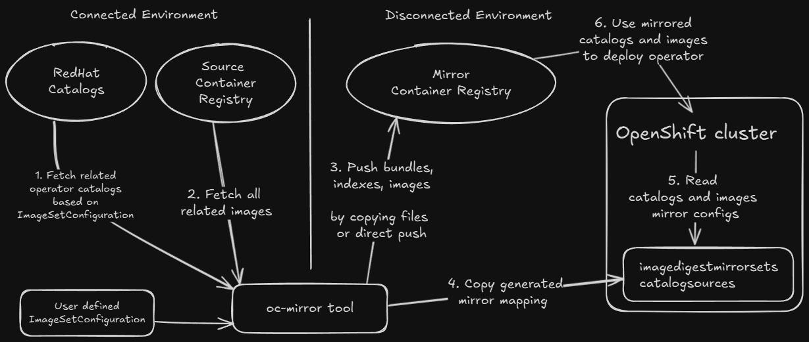

# Air-gapped Installation Guide for OpenShift Environments

This guide explains how to install the AMD GPU Operator in an air-gapped environment where the OpenShift cluster has no external network connectivity.

## Prerequisites

- OpenShift 4.16+
- Users should have followed the [OpenShift Official Documentation](https://docs.redhat.com/en/documentation/openshift_container_platform/4.19/html/disconnected_environments/mirroring-in-disconnected-environments) to install the air-gapped cluster and set up a Mirror Registry.



```{Note}
  * Users only need to provide the `ImageSetConfiguration` to configure operator catalogs and images for mirroring artifacts into the mirror container registry.
  * Users may need to manually copy mirrored artifacts to the air-gapped system if the jump host cannot directly push images to the mirror container registry.
  * Most steps in the diagram above are automatically completed by `oc-mirror` and other Red Hat provided tools, which can be downloaded from the [OpenShift official website](https://console.redhat.com/openshift/downloads).
```

Here is an example `ImageSetConfiguration` for mirroring the required catalogs and images for the AMD GPU Operator into your mirror registry.

```{Warning}
1. The following `ImageSetConfiguration` file is an incomplete example.
2. Users must configure the `storageConfig` section for either directly pushing artifacts to the mirror container registry or saving to local file storage.
3. Users may merge the `mirror` section of this example with their own `ImageSetConfiguration`.
4. Detailed explanation of `ImageSetConfiguration` can be found in the [OpenShift official documentation](https://docs.redhat.com/en/documentation/openshift_container_platform/4.19/html/disconnected_environments/mirroring-in-disconnected-environments#using-oc-mirror_about-installing-oc-mirror-v2).
5. When mirroring the source image `docker.io/rocm/amdgpu-driver`, we strongly recommend making it accessible without requiring image pull secrets. If image pull secrets are required for pulling the source image, refer to the notes in [Driver Installation](../drivers/installation.md#install-out-of-tree-amd-gpu-drivers-with-operator) to configure the pull secret.
```

```yaml
# oc-mirror --v2 compatible ImageSetConfiguration
kind: ImageSetConfiguration
apiVersion: mirror.openshift.io/v1alpha2
mirror:
  # in this file we use 4.19 as an example
  # please adjust the OpenShift version if needed
  platform:
    graph: true 
    channels:
      # adjust the minor version and patch version if needed
      - name: stable-4.19
        minVersion: 4.19.13
        maxVersion: 4.19.13

  operators:
    - catalog: registry.redhat.io/redhat/redhat-operator-index:v4.19 # adjust the OpenShift version if needed
      packages:
        # Node Feature Discovery (NFD)
        - name: nfd
          minVersion: "4.19.0-202509300824" # adjust the version if needed
          channels:
            - name: stable
        # Kernel Module Management (KMM)
        - name: kernel-module-management
          minVersion: "2.4.1" # adjust the version if needed
          channels:
            - name: stable
            - name: release-2.4

    # AMD GPU Operator (Certified)
    # To get full list of released version
    # Either go to OperatorHub
    # Or check https://github.com/redhat-openshift-ecosystem/certified-operators/tree/main/operators/amd-gpu-operator
    - catalog: registry.redhat.io/redhat/certified-operator-index:v4.19 # adjust the OpenShift version if needed
      packages:
        - name: amd-gpu-operator
          minVersion: "1.3.2" # adjust the version if needed
          channels:
            - name: alpha
  # adjust the image tags if needed
  additionalImages:
    - name: registry.redhat.io/ubi9/ubi:latest
    - name: registry.redhat.io/ubi9/ubi-minimal:latest
    - name: docker.io/rocm/gpu-operator:v1.3.1
    - name: docker.io/rocm/gpu-operator-utils:v1.3.1
    - name: docker.io/busybox:1.36
    - name: docker.io/rocm/device-metrics-exporter:v1.3.1
    - name: docker.io/rocm/test-runner:v1.3.1
    - name: docker.io/rocm/device-config-manager:v1.3.1
    - name: docker.io/rocm/rocm-terminal:latest
    - name: docker.io/rocm/k8s-device-plugin:latest
    - name: docker.io/rocm/k8s-node-labeller:latest
    # adjust RHEL version and ROCm version if needed for source image
    # image tag format for CoreOS is coreos-<RHEL version>-<ROCm version>
    - name: docker.io/rocm/amdgpu-driver:coreos-9.6-7.0.2

helm: {}
```

- After mirroring setup, users should have installed NFD and KMM, and enabled the internal image registry in the air-gapped cluster. See [OpenShift OLM Installation](../installation/openshift-olm.md#configure-internal-registry) for details.

- Users should have installed the AMD GPU Operator in the air-gapped cluster without creating a `DeviceConfig`.

## Installation Steps

```{Note}
Starting from AMD GPU Operator v1.4.1, building the amdgpu driver directly within the disconnected cluster is supported.

**Option 1:** Follow steps 1 and 2 to prepare a pre-compiled driver image in a connected environment, then import the pre-compiled image into the disconnected cluster.

**Option 2:** Skip preparing a pre-compiled driver image and go directly to step 3, ensuring that:
    
* The source image `docker.io/rocm/amdgpu-driver` is properly mirrored into your mirror image registry in the disconnected environment.
 
* The `oc-mirror` generated `ImageDigestMirrorSet` and `ImageTagMirrorSet` are applied.
```

### 1. Build Precompiled Driver Image

Build the pre-compiled driver image in a build cluster that has internet access by following [Preparing Pre-compiled Driver Images](../drivers/precompiled-driver.md) and the steps for OpenShift.

After successfully pushing the driver image, save it by running:

- If you are using OpenShift internal registry

```bash
podman login -u deployer -p $(oc create token deployer) image-registry.openshift-image-registry.svc:5000
podman pull image-registry.openshift-image-registry.svc:5000/default/amdgpu_kmod:coreos-9.6-5.14.0-570.45.1.el9_6.x86_64-7.0
podman save image-registry.openshift-image-registry.svc:5000/default/amdgpu_kmod:coreos-9.6-5.14.0-570.45.1.el9_6.x86_64-7.0 -o driver-image.tar
```

- If you are using other image registry

```bash
podman login -u username -p password/token registry.example.com
podman pull registry.example.com/amdgpu_kmod:coreos-9.6-5.14.0-570.45.1.el9_6.x86_64-7.0
podman save registry.example.com/amdgpu_kmod:coreos-9.6-5.14.0-570.45.1.el9_6.x86_64-7.0 -o driver-image.tar
```

### 2. Import Pre-compiled Driver Image

A. Import images

```{Note}
1. This step is for using the pre-compiled driver image within the OpenShift internal registry (the OpenShift built-in image registry, not the mirror registry for air-gapped installation). 
2. Users who have already pushed the pre-compiled driver image to another registry don't need to manually load it into the internal registry. Skip to step 3 and specify the image URL in `spec.driver.image`.
```

- Import pre-compiled driver image

After copying the image files to the air-gapped cluster, switch to the air-gapped cluster and use podman to load the image, re-tag if needed, then push the image to the desired image registry:

- Load the image file: `podman load -i driver-image.tar`
- Re-tag if needed: `podman tag <old tag> <new tag>`. Remember to tag the image to the GPU operator's namespace. For example, if using the GPU operator in `openshift-amd-gpu`, tag the image to `image-registry.openshift-image-registry.svc:5000/openshift-amd-gpu/amdgpu_kmod`.
- Use podman to log in to the image registry if needed. For OpenShift internal registry:

  ```bash
  podman login -u builder -p $(oc create token builder) image-registry.openshift-image-registry.svc:5000
  ```

- Push the image: `podman push <new tag>`

B. Verify that the required images are located in the internal registry.

For example, if using the internal registry:

```bash
$ oc get is -n openshift-amd-gpu
NAME                      IMAGE REPOSITORY                                                                        TAGS                                            UPDATED
amdgpu_kmod               image-registry.openshift-image-registry.svc:5000/openshift-amd-gpu/amdgpu_kmod               coreos-9.6-5.14.0-570.19.1.el9_6.x86_64-6.4.1   3 days ago
```

### 3. Deployment of DeviceConfig in Air-gapped Environment

A. If pre-compiled driver images are present, the operator will directly pull and use the pre-compiled driver image.
B. If pre-compiled driver images are not present, the operator will build the kernel module based on the mirrored source image, which was previously mirrored from `docker.io/rocm/amdgpu-driver`.

```yaml
apiVersion: amd.com/v1alpha1
kind: DeviceConfig
metadata:
  name: test-deviceconfig
  namespace: openshift-amd-gpu
spec:
  driver:
    # Specify image repo here if NOT using OpenShift internal registry without image tag
    # Default value for OpenShift is image-registry.openshift-image-registry.svc:5000/$MOD_NAMESPACE/amdgpu_kmod
    #image: registry.example.com/amdgpu_kmod
    enable: true
    # For OpenShift, set useSourceImage to true 
    # to enable building driver from source code image in air-gapped environment
    useSourceImage: true
    version: "7.0"
  devicePlugin:
    enableNodeLabeller: true
  metricsExporter:
    enable: true
  selector:
    feature.node.kubernetes.io/amd-gpu: "true"
```

### 4. Verify the Deployment of DeviceConfig

After successfully building the driver image and loading the `amdgpu` kernel modules, the metrics exporter and device plugin pods should be running in the same namespace as the `DeviceConfig`.

```bash
$ oc get pods -n openshift-amd-gpu
NAME                                                              READY   STATUS      RESTARTS   AGE
amd-gpu-operator-controller-manager-d7654f88d-4x4tx               1/1     Running     0          6h45m
test-cr-device-plugin-5w7dp                                       1/1     Running     0          2m
test-cr-metrics-exporter-5xwwr                                    1/1     Running     0          2m
```

If the driver loaded correctly without any issues, the device plugin will start advertising resources. If the device plugin is running but the node still shows zero `amd.com/gpu`, check the device plugin pod logs or `dmesg` on the node to detect potential failures.

```bash
$ oc get node -oyaml | grep amd.com
      gpu.operator.amd.com/openshift-amd-gpu.test-cr.driver: container
      amd.com/gpu: "1"
      amd.com/gpu: "1"
```
