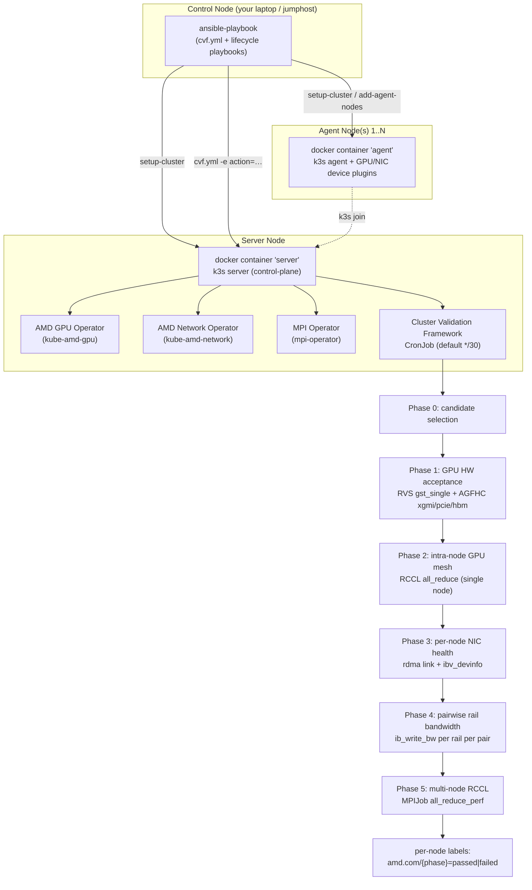

# GPU Validation Cluster

A containerized, one-click deployment solution for validating AMD GPU and AINIC in a cluster.

## Overview

This project provides an automated, reproducible testing environment for AMD GPU + AMD AINIC validation at fleet scale. A single Ansible run brings up a containerized k3s cluster across N nodes, installs the AMD GPU + Network operators, and deploys the Cluster Validation Framework (CVF) — a CronJob-driven, 5-phase gated pipeline that exercises GPUs, intra-node xGMI, per-NIC RDMA health, per-rail bandwidth, and multi-node RCCL collectives.



## Features

- **One-command multi-node deployment** via Ansible (`playbooks/setup-cluster.yml`)
- **AMD GPU + Network operators** pre-configured (inbox driver by default; operator-installed driver opt-in)
- **5-phase validation pipeline** with per-phase skip flags, per-stage timeouts, and per-framework test-runner images
- **Day-2 operations playbook** (`playbooks/cvf.yml`) — single dispatcher for reapply / reset / inject-secret / trigger / status / fresh-run
- **Persistent per-phase logs** on each node under `/var/log/cluster-validation/` (Phase 1 test-runner, Phase 2 RCCL, Phase 3 NIC probes, Phase 4 ib_write_bw server+client, Phase 5 RCCL launcher)
- **Containerized** — entire stack runs in `docker` so the host stays clean

## Quick Start

Multi-node deployment is fully Ansible-driven. The flow is **(1) edit `configs/config.json`** for your environment, then **(2) run two playbooks**: `setup-cluster.yml` for one-time bringup, `cvf.yml` for all day-2 operations.

### Prerequisites

**Host OS (required, every cluster node):**

- **Ubuntu 22.04 LTS** or **Ubuntu 24.04 LTS** — these are the only validated host OS versions. Other distros and other Ubuntu versions are not supported by the bringup playbook (Docker install, kernel-module DKMS, and the operator chart all assume Ubuntu LTS).

**Per cluster node:**

- Docker daemon running (the playbook will install it if missing)
- `jq` CLI (installed by the playbook if missing)
- `amdgpu` + `ionic` (and `ionic_rdma`) kernel modules present — either inbox or installed by the AMD operators (see step 0.1)
- SSH access from the control node (configured by `setup-ssh-keys.yml`)

**Control node (your laptop or jumphost):**

- Ansible 2.9+
- SSH key to every cluster node (set up via `setup-ssh-keys.yml` if not already in place)
- Working copy of this repo + an `ansible/inventory.yml` that lists the server + agent nodes

### Step 0 — Pre-flight configuration

Edit `configs/config.json` **before** running any playbook. The settings drive what the framework installs, runs, and how long it waits.

#### 0.1 Driver source: inbox vs operator-installed

Each AMD operator can either (a) use the host's existing kernel module ("inbox") or (b) install/manage its own driver. Default is **inbox** for both.

```jsonc
"amd-gpu-operator": {
  "version": "v1.4.1",                       // operator chart version
  "install-amdgpu-driver": false,            // false = use host's amdgpu; true = operator installs driver-version
  "driver-version": "30.30"
},
"network-operator": {
  "version": "v1.0.0",
  "install-network-operator": true,          // optional (default true). false = skip the network operator entirely for a GPU-only cluster
  "install-ionic-driver": false,             // false = use host's ionic_rdma; true = operator installs driver-version
  "driver-version": "1.117.5-a-56"
}
```

> **GPU-only clusters:** set `install-network-operator: false` to skip the
> network operator, its `NetworkConfig`, and Multus altogether. Only do
> this when no NIC-dependent phases run — make sure Phases 3, 4, and 5 are
> skipped in `skip-tests` and that `node-selector-labels` does not require
> an `amd-nic`/`amd-vnic` label. cert-manager, the GPU operator,
> mpi-operator, and the CVF CronJob still install normally.

**How to decide:** check what's already loaded on each node before bringup.

```bash
# On every node — confirm GPU + RDMA drivers are present and report a version
modinfo amdgpu     | grep -E '^version|^srcversion' | head -1
modinfo ionic_rdma | grep -E '^version|^srcversion' | head -1
lsmod | grep -E '^amdgpu|^ionic'
```

If both are present and a known-good version, leave `install-*-driver: false`. Otherwise set to `true` and pin `driver-version` to a version supported by your kernel.

> **Container ↔ kernel ABI matching.** The `roce-workload` image used by Phases 2/4/5 ships its own `libionic` userspace which must support the host kernel's `ionic_rdma` ABI. If you see `libibverbs: Warning: Driver ionic does not support the kernel ABI of N (supports M to M)` in Phase 4 logs, swap to a `roce-workload` image whose ainic version matches the host driver (see step 0.4).

#### 0.2 Node selector labels (physical vs VF-passthrough VM)

`node-selector-labels` is an AND-list — only nodes carrying **every** label in the array are eligible for cluster validation. The label you choose depends on whether the node exposes physical AMD devices or virtual-function (VF) passthrough devices to a guest VM:

| Label | Means | Set by |
|---|---|---|
| `feature.node.kubernetes.io/amd-gpu=true` | Physical AMD GPU (bare metal / VM with PF-passthrough) | NFD + AMD GPU operator |
| `feature.node.kubernetes.io/amd-vgpu=true` | **VF-passthrough** AMD GPU inside a guest VM (SR-IOV VF assigned to the VM) | NFD + AMD GPU operator (VM-aware) |
| `feature.node.kubernetes.io/amd-nic=true` | Physical AMD Pensando NIC (bare metal / VM with PF-passthrough) | NFD + AMD Network operator |
| `feature.node.kubernetes.io/amd-vnic=true` | **VF-passthrough** AMD Pensando NIC inside a guest VM (SR-IOV VF assigned to the VM) | NFD + AMD Network operator (VM-aware) |

Default in `config.json` (physical GPU + physical NIC fleet):
```jsonc
"node-selector-labels": [
  "feature.node.kubernetes.io/amd-gpu=true",
  "feature.node.kubernetes.io/amd-nic=true"
]
```

**Tune for your fleet:**

| Posture | `node-selector-labels` |
|---|---|
| Bare-metal / PF-passthrough VM (default) | `["amd-gpu=true", "amd-nic=true"]` |
| Fully virtualized (VF GPU + VF NIC inside guest VM) | `["amd-vgpu=true", "amd-vnic=true"]` |
| Mixed (VF GPU + PF NIC, etc.) | mix and match the four labels |
| Early bringup, no NIC yet | drop the NIC label: `["amd-gpu=true"]` only |

**Verify what's actually labeled** before changing this:
```bash
ansible -i ansible/inventory.yml server-node -m shell -a \
  "docker exec server kubectl get nodes -L feature.node.kubernetes.io/amd-gpu \
                                          -L feature.node.kubernetes.io/amd-vgpu \
                                          -L feature.node.kubernetes.io/amd-nic \
                                          -L feature.node.kubernetes.io/amd-vnic"
```

NFD applies these labels asynchronously after the corresponding operator's device plugin advertises a resource. If a node shows the device under `kubectl describe node` capacity but the label is missing, the operator hasn't completed its NFD rule rollout yet — wait \~1 min and re-check.

> **Custom (non-NFD) labels must be applied by you.** Only the four
> `feature.node.kubernetes.io/amd-{gpu,vgpu,nic,vnic}` labels above are
> set automatically (by NFD). If you set `node-selector-labels` to a
> custom label such as `["cvf-candidate=true"]`, **nothing applies it for
> you** — you must label the target nodes yourself, or Phase 0 will match
> zero nodes and every CronJob tick will skip with
> `[Node Selection: WARNING] Selector '...' matched 0 nodes`:
> ```bash
> docker exec server kubectl label node <node-name> cvf-candidate=true
> ```
> This is a useful pattern when you want to *explicitly* opt nodes into
> validation rather than auto-selecting every GPU/NIC node.

> **Note:** the orchestrator uses these labels for Phase 0 candidate selection. NIC-requiring phases (Phase 3 / Phase 4) further narrow inside their own per-phase script via intersection with `amd-nic=true` (or `amd-vnic=true` if you set it), so non-NIC nodes pass through GPU-only phases cleanly without entering the NIC phases.

#### 0.3 Which phases / stages to run + estimated runtime

Two layers of skip flags: **per-phase** (5 flags) and **per-Phase-1-stage** (4 flags).

```jsonc
"skip-tests": {
  "skip-phase1-gpu-hw-acceptance":   true,   // Phase 1: RVS gst_single + AGFHC xgmi/pcie/hbm  (DEFAULT: SKIPPED, please configure your AGFHC image and pull secrets then enable this phase)
  "skip-phase2-gpu-mesh-validation": false,  // Phase 2: intra-node 8-rank RCCL all_reduce
  "skip-phase3-nic-validation":      false,  // Phase 3: per-node NIC health (needs amd-nic=true)
  "skip-phase4-rail-bandwidth-test": false,  // Phase 4: pairwise ib_write_bw per rail
  "skip-phase5-rccl-test":           false,  // Phase 5: multi-node RCCL via MPIJob
  "skip-phase1-stages": {                    // Only consulted when skip-phase1-gpu-hw-acceptance=false
    "skip-phase1-gpu-stress": true,          // gst_single (RVS)        ~15-30 min/node
    "skip-phase1-xgmi-lvl1":  true,          // xgmi_lvl1  (AGFHC)      ~3-5 min/node  (private image)
    "skip-phase1-pcie-lvl1":  true,          // pcie_lvl1  (AGFHC)      ~3-5 min/node  (private image)
    "skip-phase1-hbm-lvl1":   true           // hbm_lvl1   (AGFHC)      ~3-5 min/node  (private image)
  }
}
```

The default skips all of Phase 1 (no AGFHC pull secret required out of the box) and runs Phase 2 → 5. Set `skip-phase1-gpu-hw-acceptance: false` then enable individual stages in `skip-phase1-stages` when you want HW acceptance coverage — and remember to inject the AGFHC pull secret (step 0.5) if any of the `xgmi/pcie/hbm-lvl1` stages are enabled.

**Estimated per-phase wallclock (per node, in parallel across nodes):**

| Phase | Stages / contents | Typical | Worst-case (timeout) |
|---|---|---|---|
| 1.gpu-stress | RVS gst_single (FP8/FP16/dgemm sweep) | 15-30 min | 60 min |
| 1.xgmi-lvl1  | AGFHC xGMI link sweep | 3-5 min | 20 min |
| 1.pcie-lvl1  | AGFHC PCIe lane sweep | 3-5 min | 20 min |
| 1.hbm-lvl1   | AGFHC HBM ECC sweep | 3-5 min | 20 min |
| 2 | intra-node 8-rank RCCL all_reduce | 3-8 min | 10 min |
| 3 | per-node NIC health (count, ip link, rdma link, ibv_devinfo) | 30s-2 min | 5 min |
| 4 | pairwise `ib_write_bw` × 8 rails per pair (rails serialized) | 1-2 min × 8 = 8-16 min per pair (pairs run in parallel) | 40 min per pair |
| 5 | multi-node RCCL MPIJob (`all_reduce_perf`) | 1-5 min | 5 min |

**Suggested bringup postures:**

| Posture | Skip flags | Use when |
|---|---|---|
| **Network-focused** (default) | P1 skipped, P2+P3+P4+P5 enabled | network fabric + RCCL stack validation; no AGFHC pull secret needed |
| **GPU HW acceptance only** | P1 enabled (set `skip-phase1-stages.*` to choose stages), P2+P3+P4+P5 skipped | new GPU node bringup; HW burn-in; requires AGFHC pull secret if xgmi/pcie/hbm-lvl1 enabled |
| **GPU-only smoke** | P1+P2 enabled, P3+P4+P5 skipped | datacenter early, no NIC infrastructure yet |
| **Full pipeline** | all 5 enabled | full HW + fabric + workload validation; requires AGFHC pull secret |

#### 0.4 Per-step container images

```jsonc
"images": {
  "roce-workload":   "docker.io/rocm/roce-workload:ubuntu24_rocm-7.0.2_rccl-7.0.2_anp-v1.2.0_ainic-1.117.5-a-56",
  "test-runner": {
    "rvs":   "docker.io/rocm/test-runner:v1.4.0",                 // Phase 1 gpu-stress
    "agfhc": "docker.io/amdpsdo/test-runner:agfhc-v1.5.0-4"       // Phase 1 xgmi/pcie/hbm — PRIVATE, see 0.4
  },
  "orchestrator":    "docker.io/bitnamilegacy/kubectl:1.33.4",    // submit-mpijob, NAD apply
  "preflight-init":  "docker.io/bitnamilegacy/kubectl:1.33.4",    // Phase 5 launcher init container
  "nic-health":      "docker.io/rocm/roce-workload:<same tag as roce-workload above>" // Phase 3 NIC probes (now uses ${ROCE_WORKLOAD_IMAGE})
}
```

| Image | Used by | Registry |
|---|---|---|
| `rocm/test-runner` (RVS) | Phase 1 `gpu-stress` (Recipe: `gst_single`) | public (Docker Hub) |
| **`amdpsdo/test-runner:agfhc-*`** | Phase 1 `xgmi-lvl1` / `pcie-lvl1` / `hbm-lvl1` | **PRIVATE** — see 0.4 |
| `rocm/roce-workload` | Phase 2, Phase 3 NIC health Job, Phase 4 server+client, Phase 5 worker/launcher (all four pinned to one `ROCE_WORKLOAD_IMAGE` ConfigMap key) | public |
| `bitnamilegacy/kubectl` | orchestrator + Phase 5 preflight init | public |

> **roce-workload ↔ kernel ABI:** if Phase 4 fails on every rail with `libibverbs: Warning: Driver ionic does not support the kernel ABI`, your `ainic-*` tag's libionic doesn't match the host's `ionic_rdma` ABI. Try a different tag from the [`rocm/roce-workload` Docker Hub repo](https://hub.docker.com/r/rocm/roce-workload/tags).

#### 0.5 ⚠️ AGFHC requires a pull secret

If **any Phase 1 stage other than `gpu-stress` is enabled** (i.e. `xgmi-lvl1`, `pcie-lvl1`, or `hbm-lvl1`), the orchestrator will pull `docker.io/amdpsdo/test-runner:agfhc-*` — a **private Docker Hub repo**. The pod will sit in `ErrImagePull` until you inject pull credentials.

**Steps:**

1. Request an AGFHC pull token from your AMD representative.
2. Add it to `configs/config.json`:
   ```jsonc
   "global": {
     "image-pull-secrets": [
       { "registry-url": "docker.io",
         "username":     "amdpsdo",
         "token":        "dckr_oat_…"   // your token, keep out of git
       }
     ]
   }
   ```
3. Inject it into the running cluster:
   ```bash
   ansible-playbook -i ansible/inventory.yml ansible/playbooks/cvf.yml -e action=inject-secret
   ```
4. (Alternative — keep token out of `config.json`) inject ad-hoc via CLI override:
   ```bash
   ansible-playbook -i ansible/inventory.yml ansible/playbooks/cvf.yml -e action=inject-secret \
       -e username=amdpsdo -e token=dckr_oat_…
   ```

The playbook is idempotent (additive strategic-merge patch on `cluster-validation-sa.imagePullSecrets`). See [`ansible/README.md`](ansible/README.md) for full details.

If `xgmi-lvl1` / `pcie-lvl1` / `hbm-lvl1` are all set to `skip: true`, no secret is needed.

#### 0.6 Timeouts

Make sure each per-phase budget is generous enough for your hardware — a too-tight budget kills the test Job mid-run and the orchestrator records it as a failure even when the underlying test was about to pass.

```jsonc
"timeouts": {
  "phase1-stages-secs": {
    "phase1-gpu-stress": 3600,   // gst_single can take 30+ min on slower nodes; 1h headroom
    "phase1-xgmi-lvl1":  1200,
    "phase1-pcie-lvl1":  1200,
    "phase1-hbm-lvl1":   1200
  },
  "phase2-job-wait-secs":    600,
  "phase3-job-wait-secs":    300,
  "phase4-pair-wait-secs":   300,
  "phase5-mpijob-wait-secs": 300
}
```

Tuning advice:

- If you see Phase 1 stages marked TIMEOUT but the persistent log under `/var/log/cluster-validation/<TS>_<recipe>_stdout.gz` shows the test still progressing → **raise** the corresponding `phase1-stages-secs` entry.
- If you see Phase 4 `ib-write-bw-crashed` on every rail → **not** a timeout issue; check the persistent log `/var/log/cluster-validation/<TS>_phase4-{server,client}_railN.log` (libionic ABI mismatch, missing per-rail NAD, etc.).
- Per-node-interval `resources.node-validation-interval-mins: 30` controls how often a single node re-runs; lower it (e.g. 10) only if you want tighter feedback during bringup.

#### 0.7 Advanced — everything else lives in YAML

`config.json` is intentionally narrow (resources, skip flags, timeouts, images, schedule). For deeper tuning open `configs/cluster-validation-config.yaml` — every field that's overridable via `config.json` carries a `# patchable: <json-path>` marker; everything else is a tunable that requires editing the YAML directly. Examples of YAML-only knobs:

| YAML key (search in `cluster-validation-config.yaml`) | What it controls |
|---|---|
| `PHASE2_BW_THRESHOLD` | min intra-node RCCL all_reduce GB/s for Phase 2 PASS |
| `PHASE4_BW_THRESHOLD`, `PHASE4_RAIL_COUNT`, `PHASE4_MAX_CONCURRENT_PAIRS`, `PHASE4_IB_DEV_PREFIX`, `PHASE4_NAD_NAME_PREFIX` | Phase 4 bandwidth threshold, rails per pair, parallelism cap, RDMA device prefix, NAD prefix |
| `PHASE3_EXPECTED_NIC_COUNT`, `PHASE3_AMD_NIC_PCI_IDS`, `PHASE3_MIN_GID_COUNT` | Phase 3 NIC count + PCI ID allowlist + minimum GID count |
| `RCCL_ENV_VARS`, `PHASE2_RCCL_ENV_VARS` | NCCL/RCCL env-var blocks for Phase 5 vs single-node Phase 2 |
| `GPU_VALIDATION_STAGES_JSON` | full Phase 1 stage spec (Name, Framework, Recipe, Iterations, TimeoutSeconds, Arguments) — patchable per-field via `config.json`, or replace wholesale here |
| `PHASE45_PREFLIGHT_SCRIPT`, `PHASE5_LAUNCHER_SCRIPT`, `PHASE5_WORKER_SCRIPT` | the actual bash bodies run inside each phase's pods |

After editing the YAML, push to the live cluster with `ansible-playbook playbooks/cvf.yml -e action=reapply`.

### Step 1 — One-time bringup

```bash
cd ansible

# 1a. (only first time) configure passwordless SSH to all nodes
ansible-playbook -i inventory.yml playbooks/setup-ssh-keys.yml --ask-pass --ask-become-pass

# 1b. bring up the cluster (k3s + operators + CVF CronJob)
ansible-playbook -i inventory.yml playbooks/setup-cluster.yml
```

`setup-cluster.yml` builds the Docker image once on the control node, ships the tar to every node, starts the `server` container on the server node, then joins the `agent` containers. Estimated 10-20 min depending on network speed and node count.

### Step 2 — Day-2 operations via `cvf.yml`

All CVF runtime operations live in one playbook dispatched by `-e action=<name>`:

```bash
# After editing configs/*.yaml or config.json, push changes to the live cluster
ansible-playbook -i inventory.yml playbooks/cvf.yml -e action=reapply

# Clear per-phase node labels + annotations (forces a fresh full run on next trigger)
ansible-playbook -i inventory.yml playbooks/cvf.yml -e action=reset

# Inject AGFHC pull secret(s) into the live SA (idempotent)
ansible-playbook -i inventory.yml playbooks/cvf.yml -e action=inject-secret

# Trigger one validation run manually (creates Job 'cvf-test'; default schedule is */30)
ansible-playbook -i inventory.yml playbooks/cvf.yml -e action=trigger

# Full status dump: CronJob, recent orchestrators, in-flight Jobs, per-node phase labels + failure annotations
ansible-playbook -i inventory.yml playbooks/cvf.yml -e action=status

# Composite: reapply -> reset (delete_all_jobs=true) -> inject-secret -> trigger -> status
ansible-playbook -i inventory.yml playbooks/cvf.yml -e action=fresh-run
```

> **Cron-vs-manual race:** the CronJob's `concurrencyPolicy: Forbid` blocks cron-vs-cron overlap but **not** manual-vs-cron. If a manual `trigger` exceeds the `*/30` schedule, the next cron tick spawns a second orchestrator that fights for the same nodes. For manual runs expected to exceed 30 min, suspend the cron first:
> ```bash
> ansible-playbook playbooks/cvf.yml -e action=reset -e suspend_cronjob=true
> ansible-playbook playbooks/cvf.yml -e action=trigger
> # ...after completion, re-enable:
> docker exec server kubectl patch cronjob cluster-validation-cron-job \
>   -n default --type=merge -p '{"spec":{"suspend":false}}'
> ```

See [`ansible/README.md`](ansible/README.md) for the full `cvf.yml` action reference (all flags, idempotency notes, race-condition documentation).

### Step 3 — Tear down

```bash
ansible-playbook -i inventory.yml playbooks/teardown-cluster.yml
```

## Multi-Phase Validation Pipeline

The cluster validation framework runs a single CronJob (`cluster-validation-cron-job`) that drives a **5-phase, gated state machine**. Each phase narrows the candidate node pool: a node MUST pass phase N to enter phase N+1. Phases are independently enable-able via the `skip-tests` block in `config.json`, so a datacenter early in bringup can run only the GPU-only phases (1+2) and light up downstream phases as NIC and rail infrastructure arrive. The orchestrator skeleton, the per-phase `run_phaseN` stubs, the `DRY_RUN=1` planning mode, and the shared node-label helper library all live in `configs/cluster-validation-config.yaml`; the CronJob shell lives in `configs/cluster-validation-job.yaml`.

### Phases, Labels, and Skip Flags

| Phase | Purpose | `config.json` skip flag | ConfigMap env var | Per-phase node label key | Default |
|-------|---------|-------------------------|-------------------|--------------------------|---------|
| 1 | GPU HW acceptance (RVS / AGFHC via Test Runner) | `skip-gpu-hw-acceptance` | `SKIP_GPU_HW_ACCEPTANCE` | `amd.com/gpu-hw-acceptance` | enabled |
| 2 | Intra-node GPU collective / mesh validation | `skip-gpu-mesh-validation` | `SKIP_GPU_MESH_VALIDATION` | `amd.com/gpu-mesh-validation` | enabled |
| 3 | Per-node NIC health (requires `amd-nic=true`) | `skip-nic-validation` | `SKIP_NIC_VALIDATION` | `amd.com/nic-health` | skipped |
| 4 | Pairwise rail bandwidth | `skip-rail-bandwidth-test` | `SKIP_RAIL_BANDWIDTH_TEST` | `amd.com/rail-bandwidth` | skipped |
| 4.5 | Cross-node connectivity matrix (pre-flight gate before Phase 5) | (shares `skip-rccl-test`) | (shares `SKIP_RCCL_TEST`) | (no new label key; annotation only) | skipped (with Phase 5) |
| 5 | Multi-node RCCL via MPIJob | `skip-rccl-test` | `SKIP_RCCL_TEST` | `amd.com/cluster-validation-status` | skipped |

On each phase, the per-phase script labels every input node with either `<phase_label_key>=passed` or `<phase_label_key>=failed`. On failure it also writes a failure-reason annotation:

```text
<phase_label_key>-failure-reason=<reason>
```

(The suffix `-failure-reason` is published as the ConfigMap constant `PHASE_FAILURE_REASON_ANNOTATION_SUFFIX`.) The phase label is the **only contract** between phases — phase scripts MUST use the `label_phase_passed` / `label_phase_failed` / `annotate_phase_value` helpers from `PHASE_NODE_LABEL_SCRIPT` rather than calling `kubectl label` directly, and they MUST read `PHASE{N}_LABEL_KEY` from the ConfigMap rather than hard-coding key names.

### Phase 1: Per-Node GPU Hardware Acceptance

**Scope:** First gate of the pipeline. Per-node, no-network GPU hardware acceptance using a Test Runner image (`rocm/test-runner` by default). The phase catches dead GPUs, thermal issues, HBM errors, PCIe degradation, and xGMI link issues at boot.

**Result label:** `amd.com/gpu-hw-acceptance=passed|failed`. Only nodes labeled `passed` advance to Phase 2.

**Multi-stage execution model.** The ROCm test-runner CLI executes only the first `TestCases[]` entry per invocation, so Phase 1 runs one Test Runner Job *per recipe per candidate node*. The orchestrator iterates the configured stages **sequentially per node** with **stop-on-first-failure** semantics: stage S submits one Job per still-alive node *in parallel*, waits for the whole batch, drops any node that failed, then moves to stage S+1. Cross-node parallelism is preserved within each stage; cross-stage execution is gated by the previous stage's per-node result.

Each stage is fully self-describing in the `GPU_VALIDATION_STAGES_JSON` ConfigMap key — including its own `Image`, allowing RVS and AGFHC test-runner images to be pinned to different versions:

```yaml
GPU_VALIDATION_STAGES_JSON: |
  [
    { "Name": "gpu-stress",  "Image": "docker.io/rocm/test-runner:v1.4.0",
      "Framework": "RVS",   "Recipe": "gst_single",
      "Iterations": 1, "TimeoutSeconds": 1800, "Arguments": "--parallel" },
    { "Name": "xgmi-lvl1",  "Image": "docker.io/rocm/test-runner:v1.4.0",
      "Framework": "AGFHC", "Recipe": "xgmi_lvl1",
      "Iterations": 1, "TimeoutSeconds": 300,  "Arguments": "" },
    { "Name": "pcie-lvl1",  "Image": "docker.io/rocm/test-runner:v1.4.0",
      "Framework": "AGFHC", "Recipe": "pcie_lvl1",
      "Iterations": 1, "TimeoutSeconds": 300,  "Arguments": "" },
    { "Name": "hbm-lvl1",   "Image": "docker.io/rocm/test-runner:v1.4.0",
      "Framework": "AGFHC", "Recipe": "hbm_lvl1",
      "Iterations": 1, "TimeoutSeconds": 300,  "Arguments": "" }
  ]
```

| Field | Purpose |
|-------|---------|
| `Name` | Orchestrator identifier for the stage. Used in per-stage ConfigMap names (`cvf-phase1-<name>-<node-hash>-<ts>`), Job names (`cvf-tr-<name>-<node-hash>-<ts>`), and per-stage annotations. Must be DNS-1123-safe (lowercase alphanumerics + `-`). |
| `Image` | Test Runner image used **for this stage only**. Lets RVS and AGFHC ship independently. |
| `Framework` / `Recipe` / `Iterations` / `TimeoutSeconds` / `Arguments` | Passed verbatim into the runner as a single-element `TestCases[]` payload via a per-stage per-node ConfigMap. |

Per-stage Job wait budget = `TimeoutSeconds + 120s` (pod-startup slack). There is **no** global `TEST_RUNNER_JOB_WAIT_TIME` — each stage owns its own budget.

**Default sub-tests.** The shipped `GPU_VALIDATION_STAGES_JSON` defines these four stages, executed in array order:

| # | Stage `Name` | Framework | Recipe | Purpose |
|---|--------------|-----------|--------|---------|
| 1 | `gst-single` | RVS | `gst_single` | Single-GPU stress (compute + memory) — baseline GPU health |
| 2 | `xgmi-lvl1` | AGFHC | `xgmi_lvl1` | xGMI inter-GPU link integrity (level-1) |
| 3 | `pcie-lvl1` | AGFHC | `pcie_lvl1` | PCIe link integrity, lane width / speed (level-1) |
| 4 | `hbm-lvl1` | AGFHC | `hbm_lvl1` | HBM memory integrity (level-1) |

**Per-stage annotation scheme.** Independent of the aggregate `amd.com/gpu-hw-acceptance` label, each stage writes its own annotation per node:

```text
amd.com/gpu-hw-acceptance-stage-<name>=passed|failed
```

If a stage fails, subsequent stages are *not* submitted for that node, so no annotation is written for stages after the failing one. The aggregate label is `passed` only when **all** stages pass for the node; on first failure, the aggregate label becomes `failed` and the standard `-failure-reason` annotation is set to `stage-<name>:<reason>` (e.g., `stage-hbm-lvl1:subtest-failed:hbm_lvl1`), with `-failed-subtest=<recipe>` for sub-test failures.

**Sample failure annotation output.** When the `hbm-lvl1` stage fails on a node, the prior stages' per-stage annotations are still recorded:

```text
$ kubectl describe node smc300x-ccs-aus-gpuf268
Name:               smc300x-ccs-aus-gpuf268
Labels:             amd.com/gpu-hw-acceptance=failed
                    feature.node.kubernetes.io/amd-gpu=true
                    ...
Annotations:        amd.com/gpu-hw-acceptance-stage-gst-single=passed
                    amd.com/gpu-hw-acceptance-stage-xgmi-lvl1=passed
                    amd.com/gpu-hw-acceptance-stage-pcie-lvl1=passed
                    amd.com/gpu-hw-acceptance-stage-hbm-lvl1=failed
                    amd.com/gpu-hw-acceptance-failure-reason=stage-hbm-lvl1:subtest-failed:hbm_lvl1
                    amd.com/gpu-hw-acceptance-failed-subtest=hbm_lvl1
                    amd.com/cluster-validation-last-run-timestamp=2026-05-20T14:32:11Z
                    ...
```

Other failure reasons the phase can emit (in the `-failure-reason` annotation, always prefixed with `stage-<name>:`):

| Reason value | Meaning |
|--------------|---------|
| `stage-<name>:subtest-failed:<recipe>` | The named sub-test in the stage failed; `<recipe>` also appears in `-failed-subtest`. |
| `stage-<name>:recipe-not-found` | The AGFHC/RVS recipe is missing from this stage's `Image`. `-failed-subtest=<recipe>`. Action: upgrade the `Image` field for the affected stage in `GPU_VALIDATION_STAGES_JSON`. |
| `stage-<name>:test-runner-did-not-emit-results` | Job completed but `result.json` is absent. `-failed-subtest=unknown`. |
| `stage-<name>:timeout` | Job exceeded the stage's `TimeoutSeconds + 120s` budget. |
| `stage-<name>:configmap-creation-failed` | `kubectl apply` on the per-stage per-node `GPU_VALIDATION_TESTS_JSON` ConfigMap returned non-zero. |
| `stage-<name>:job-creation-failed` | `kubectl apply` on the Test Runner Job returned non-zero. |
| `phase1-missing-env:<VAR>` / `phase1-stages-empty-or-invalid` / `phase1-stages-missing-fields` | Preamble validation failed before any stage was submitted; the same reason is written for every input node and no Jobs/ConfigMaps are created. |

**`SKIP_GPU_HW_ACCEPTANCE` behavior.** Setting `skip-gpu-hw-acceptance: true` in `config.json` (which renders to `SKIP_GPU_HW_ACCEPTANCE=true` in the ConfigMap) makes Phase 1 short-circuit:

- **No Test Runner Job is created** for any input node.
- Every input node is immediately labeled `amd.com/gpu-hw-acceptance=passed` via the standard `label_phase_passed` helper, so downstream `filter_passed_nodes` calls treat the node as eligible for Phase 2.
- No failure annotation is written, and no `result.json` parsing occurs.

This short-circuit exists for incremental bringup: when GPU hardware has already been independently validated (e.g., during burn-in) or when the operator wants to exercise Phases 2-5 without re-running the full HW acceptance suite each tick, `SKIP_GPU_HW_ACCEPTANCE=true` keeps the pipeline moving without consuming the ~30-minute Test Runner budget per node.

### Phase 2: Intra-Node GPU Mesh Validation

**Scope:** Second gate of the pipeline. Per-node, no-network RCCL `all_reduce_perf` across all 8 local GPUs of a node to stress the xGMI mesh under a real collective workload. One Kubernetes `batch/v1.Job` is created per candidate node that passed Phase 1; the Job is **not** an MPIJob — launcher and worker are co-located in a single pod, and `mpirun --np 8 --host localhost --allow-run-as-root` drives all 8 ranks locally. The phase catches xGMI link failures that only manifest under collective load, GPU mesh issues, and single-GPU instability under stress that Phase 1 single-GPU recipes can miss.

**Result label:** `amd.com/gpu-mesh-validation=passed|failed`. Only nodes labeled `passed` advance to Phase 3 (or to the per-node label being available for downstream consumers when Phases 3-5 are skipped).

**Workload.** The container runs the RCCL `all_reduce_perf` benchmark from the `rocm/roce-workload` image (already used by Phase 5), driven by `mpirun` against the 8 GPUs requested via `amd.com/gpu: 8`:

```bash
mpirun --np 8 --host localhost --allow-run-as-root \
       --mca btl ^vader,openib \
       $PERF_TEST_DIR/all_reduce_perf \
         -b $PHASE2_START_MSG_SIZE -e $PHASE2_END_MSG_SIZE \
         -f $PHASE2_STEP_FACTOR -g 1 \
         -n $PHASE2_ITER_COUNT -w $PHASE2_WARMUP_ITER_COUNT
```

After `mpirun` exits, the shared `validate-single-test.sh` parses the standard `Avg bus bandwidth` line from the RCCL output, compares it against `PHASE2_BW_THRESHOLD`, and the per-phase label/annotation helpers write the result. The per-Job template lives in the new `cluster-validation-phase2-job-config` ConfigMap (mounted into the orchestrator's `submit-mpijob` container at `/phase2-configs`); per-node rendering uses the same `sed`-substitution pattern as Phase 1's Test Runner Job.

**ConfigMap env vars (Phase 2 subset).** Tunable values are sourced from `cluster-validation-config`:

| Variable | Default | Purpose |
|----------|---------|---------|
| `PHASE2_START_MSG_SIZE` | `1K` | `-b` lower bound for `all_reduce_perf` message-size sweep |
| `PHASE2_END_MSG_SIZE` | `2G` | `-e` upper bound for the sweep |
| `PHASE2_STEP_FACTOR` | `2` | `-f` geometric step factor between message sizes |
| `PHASE2_ITER_COUNT` | `6` | `-n` measured iterations per message size |
| `PHASE2_WARMUP_ITER_COUNT` | `20` | `-w` warmup iterations (excluded from BW measurement) |
| `PHASE2_BW_THRESHOLD` | `200` | Minimum acceptable `Avg bus bandwidth` in GB/s |
| `PHASE2_JOB_WAIT_TIME` | `600` | Per-node Job wait budget in seconds |
| `PHASE2_RCCL_ENV_VARS` | (block) | RCCL/NCCL env vars sourced before `mpirun`; intra-node subset of Phase 5's `RCCL_ENV_VARS` — drops `NCCL_NET_PLUGIN` and all `NCCL_IB_*` tunables (single node, no fabric) and keeps `NCCL_DEBUG=INFO` for diagnostics |

The `PHASE2_RCCL_ENV_VARS` block deliberately contains **no IB-specific tunables** — Phase 2 exercises only the local xGMI mesh, so any IB/RoCE env var would be misleading at best and a source of false failures at worst. Phase 5 (multi-node MPIJob) is where IB/RoCE settings belong.

**Sample failure annotation output.** When the bandwidth measurement falls below the configured threshold, the node receives the `failed` label plus the uniform `-failure-reason` annotation:

```text
$ kubectl describe node smc300x-ccs-aus-gpuf268
Name:               smc300x-ccs-aus-gpuf268
Labels:             amd.com/gpu-hw-acceptance=passed
                    amd.com/gpu-mesh-validation=failed
                    feature.node.kubernetes.io/amd-gpu=true
                    ...
Annotations:        amd.com/gpu-mesh-validation-failure-reason=bus-bw-below-threshold
                    amd.com/gpu-mesh-validation-measured-bw=148.3
                    amd.com/cluster-validation-last-run-timestamp=2026-05-20T15:08:42Z
                    ...
```

Failure reasons the phase can emit (in the `-failure-reason` annotation):

| Reason value | Meaning |
|--------------|---------|
| `bus-bw-below-threshold` | RCCL completed cleanly but measured `Avg bus bandwidth` < `PHASE2_BW_THRESHOLD`. Measured value is also written to the `-measured-bw` annotation. |
| `rccl-crash` | `mpirun` exited non-zero (RCCL aborted, runtime error). Last 50 lines of `/shared/phase2.log` captured in the annotation (truncated to fit the 256 KB annotation budget). |
| `xgmi-init-failure` | RCCL failed during initialization with an xGMI-specific error class — the link came up at boot but cannot carry collective traffic. Inspect `NCCL_DEBUG=INFO` output for the offending peer pair. |
| `timeout` | Job did not complete within `PHASE2_JOB_WAIT_TIME` (typically: scheduler did not grant all 8 GPUs, or `all_reduce_perf` hung). Conservative — the node is retried on the next CronJob tick. |
| `job-creation-failed` | `kubectl apply` of the rendered Job template returned non-zero. Usually a `cluster-validation-phase2-job-config` ConfigMap deploy issue. |

**`SKIP_GPU_MESH_VALIDATION` behavior.** Setting `skip-gpu-mesh-validation: true` in `config.json` (which renders to `SKIP_GPU_MESH_VALIDATION=true` in the ConfigMap) makes Phase 2 short-circuit:

- **No Phase 2 Job is created** for any input node.
- Every input node is immediately labeled `amd.com/gpu-mesh-validation=passed` via the standard `label_phase_passed` helper, so downstream `filter_passed_nodes` calls treat the node as eligible for Phase 3 (or for being surfaced as Phase-2-clean when Phases 3-5 are also skipped).
- No failure annotation is written, and no `all_reduce_perf` log parsing occurs.

This short-circuit exists for the same incremental-bringup reasons as Phase 1: when collective behavior has already been independently validated, or when the operator wants to exercise downstream phases without consuming the per-node Phase 2 budget on every CronJob tick.

#### Threshold Tuning

`PHASE2_BW_THRESHOLD` is the single number that decides pass vs. fail when RCCL completes cleanly, so it MUST be tuned for the GPU SKU and topology in use. The default (`200` GB/s) is calibrated for MI300-series xGMI on an 8-GPU node — high enough to catch a single degraded xGMI link, low enough to absorb normal run-to-run variance.

**How to override.** Change the value in `configs/cluster-validation-config.yaml` and push it to the live cluster with `ansible-playbook playbooks/cvf.yml -e action=reapply` (re-applies + patches all ConfigMaps; no orchestrator code changes are required). Example override snippet:

```yaml
# configs/cluster-validation-config.yaml
data:
  PHASE2_BW_THRESHOLD: "180"   # relax to 180 GB/s for a slightly older silicon revision
```

The next CronJob tick will pick up the new value via the `envFrom: configMapRef` projection on the Phase 2 Job pod. Already-labeled nodes keep their existing label until the next phase run overwrites it.

**Expected ranges by GPU SKU.** Use these as starting points; always validate against a measured baseline on healthy hardware before locking in a production threshold.

| GPU SKU | xGMI generation | Typical `all_reduce_perf` `Avg bus bandwidth` (8-GPU, message sizes 1K-2G) | Suggested `PHASE2_BW_THRESHOLD` |
|---------|-----------------|----------------------------------------------------------------------------|---------------------------------|
| MI300X / MI300A | xGMI 3 (4-link, 128 GB/s/link bi-dir) | 220-260 GB/s | `200` (default) |
| MI250 / MI250X | xGMI 2 (8-link, 50-100 GB/s/link bi-dir, ring topology) | 140-180 GB/s | `120` |
| MI210 | xGMI 2 (3-link per pair) | 60-90 GB/s | `50` |
| MI100 | xGMI 1 (3-link per pair) | 40-60 GB/s | `35` |

**Tuning workflow:**

1. **Measure baseline.** On known-good hardware, set `PHASE2_BW_THRESHOLD: "1"` (effectively pass-through) and let one CronJob tick run. Read the actual `Avg bus bandwidth` from the Job pod logs or from `/var/log/cluster-validation/`.
2. **Set the threshold ~10-15% below the baseline.** Tight enough to flag a degraded link (typically one bad xGMI link drops the figure by 20-30%), loose enough to absorb normal variance.
3. **Re-test on the same node with the new threshold.** Confirm `amd.com/gpu-mesh-validation=passed`.
4. **Inject a known-bad threshold** (`PHASE2_BW_THRESHOLD: "9999"`) on one tick to confirm the failure path labels and annotates correctly (`failed-reason=bus-bw-below-threshold`, measured value recorded), then revert.

If `Avg bus bandwidth` is consistently below the suggested-range floor on healthy hardware, suspect a topology or firmware issue (xGMI link not training at full width, BIOS/SBIOS misconfiguration, ROCm/RCCL version mismatch with the silicon) rather than relaxing the threshold further.

### Phase 3: Per-Node NIC Health Check

**Scope:** Third gate of the pipeline. Per-node, structural-only RDMA NIC readiness check (no traffic generation) running on every node that passed Phase 2 **and** carries the `feature.node.kubernetes.io/amd-nic=true` label. One Kubernetes `batch/v1.Job` is created per candidate node; the Job runs the `${ROCE_WORKLOAD_IMAGE}` image (the same image pinned in `cluster-validation-config` and reused by Phases 2, 4, and 5 — see [Image switch note](#image-switch-phase-3-now-uses-roce_workload_image) below), requests all `amd.com/nic` device-plugin resources on the node (so the pod sees every NIC), and self-labels its own node via an in-pod `kubectl` against the `cluster-validation-sa` ServiceAccount. The phase catches missing NICs, drivers not loaded, bad cables, switch ports down, RoCE misconfiguration, and driver/firmware version skew before downstream phases attempt RDMA traffic.

**Result label:** `amd.com/nic-health=passed|failed`. Only nodes labeled `passed` advance to Phase 4 (or to the per-node label being available for downstream consumers when Phases 4-5 are skipped). The phase is a point-in-time structural check — link flaps that develop later are caught by Phase 4 (real RDMA traffic).

**Pre-flight + 5 structural checks.** Each Phase 3 Job runs `PHASE3_CHECK_SCRIPT` from the `cluster-validation-config` ConfigMap. The script first runs a **pre-flight self-check** (invokes `ibv_devinfo` once; non-zero exit short-circuits with `preflight-failed:ibv_devinfo=<msg>` so an `ROCE_WORKLOAD_IMAGE` ABI mismatch surfaces as a single clean failure rather than cascading into confused check-3/check-4 errors). Pre-flight is followed by five independent signals; the script aggregates failures across all five before labeling:

| # | Check | Tool | Pass criterion |
|---|-------|------|----------------|
| 1 | NIC enumeration | `lspci -Dnn` filtered by `$PHASE3_AMD_NIC_PCI_IDS` (comma-separated `vendor:device` allowlist) | Count equals `PHASE3_EXPECTED_NIC_COUNT` (default `8`) |
| 2 | Link state | `/sys/class/net/<if>/operstate` over every netdev whose `device/driver` symlink points at `ionic` | Every ionic interface reports `up` |
| 3 | RDMA link state | `rdma link show` | Every device reports state `ACTIVE` |
| 4 | GID table | `ibv_devinfo -d <dev> -v` | Each device responds and reports `>= PHASE3_MIN_GID_COUNT` GID entries (default `1`) |
| 5 | Firmware ↔ workload-image alignment | `cat /sys/class/infiniband/ionic_<N>/fw_ver` per ionic IB device, substring-matched against `$ROCE_WORKLOAD_IMAGE` (sed-substituted into the pod env at Job render time) | The observed firmware-version string appears as a substring of the workload image reference. Gated by `PHASE3_DRIVER_FW_CHECK_ENABLED` and `PHASE3_DRIVER_FW_STRICT`; "no data" (env unset OR no readable `fw_ver`) → SKIP, not FAIL |

The script does **not** short-circuit on the first failing check (Checks 1–5) — it runs all of them, then aggregates the failure reasons and the offending NIC names into annotations. Pre-flight is the one exception: pre-flight failure short-circuits because every downstream check would be tainted by the same ABI/tool fault. This keeps the failure record actionable: an operator inspecting a `failed` node sees every distinct fault on the node, not just the first one tripped.

**ConfigMap env vars (Phase 3 subset).** Tunable values are sourced from `cluster-validation-config`:

| Variable | Default | Purpose |
|----------|---------|---------|
| `PHASE3_EXPECTED_NIC_COUNT` | `8` | Required PCI device count (Check 1). Adjust for nodes with non-default NIC populations. |
| `PHASE3_AMD_NIC_PCI_IDS` | `1dd8:1002` | Comma-separated PCI `vendor:device` allowlist matched against the `[vid:did]` tag from `lspci -nn` for Check 1. **`1dd8:1002` is the Pensando DSC Ethernet Controller PF** — the canonical NIC identifier for the AMD Pensando DSC fleet (DSC-25, DSC-200, Salina). Append additional pairs (e.g. `"1dd8:1002,1dd8:1003"`) to cover a future PF revision or a second SKU. Override only when validating non-Pensando NICs. |
| `PHASE3_MIN_GID_COUNT` | `1` | Minimum GID table entries per RDMA device (Check 4). A device with zero GIDs cannot carry RoCE traffic. |
| `PHASE3_JOB_WAIT_TIME` | `120` | Per-node Job wait budget in seconds. A Job still pending past this budget is treated as `nic-not-allocated`. |
| `PHASE3_ANNOTATION_MAX_BYTES` | `250` | Maximum bytes of `failure-reason` / `failed-nics` annotation values (truncated to fit Kubernetes' 256 KB total-annotation budget on a node). |
| `PHASE3_DRIVER_FW_CHECK_ENABLED` | `"true"` | Gates Check 5 (firmware ↔ workload-image alignment). Set to `"false"` to skip the check — Phase 3 then runs only Checks 1–4 and emits the marker without the `observed_fw=` field. The pre-flight `ibv_devinfo` self-check still runs regardless. |
| `PHASE3_DRIVER_FW_STRICT` | `"true"` | When `"true"`, any per-NIC firmware-version that does NOT appear as a substring of `$ROCE_WORKLOAD_IMAGE` **fails** the node with `fw-image-mismatch:<dev>=<fw>/image=<tag>`. When `"false"`, mismatches surface only via the `-observed-fw` annotation and the check is informational. "No data" (missing env or unreadable sysfs) is always treated as SKIP, never a fail. |

**Pensando PCI device ID configuration.** Check 1 (NIC enumeration) counts the lines from `lspci -Dnn` whose trailing `[vendor:device]` tag matches one of the entries listed in `PHASE3_AMD_NIC_PCI_IDS` (comma-separated). The default `1dd8:1002` is the Pensando "DSC Ethernet Controller" PF — the device ID the kernel `ionic` driver binds to and the canonical identifier for a NIC PF on every AMD Pensando NIC variant currently shipping in the fleet (DSC-25, DSC-200, Salina). Because each Pensando card exposes six PCI functions per vendor (two PCI bridges, three Processing-accelerator sub-functions, and one Ethernet controller PF), a vendor-only filter would over-count by ~6x and SR-IOV would inflate it further; the device-ID allowlist is the precise, drift-immune signal.

To confirm on a target node:

```bash
$ lspci -Dnn | grep -E '\[1dd8:1002\]' | head
0000:05:00.0 Ethernet controller [0200]: Pensando Systems DSC Ethernet Controller [1dd8:1002]
0000:06:00.0 Ethernet controller [0200]: Pensando Systems DSC Ethernet Controller [1dd8:1002]
...
```

If the count is zero on a node that visibly has Pensando NICs, suspect (a) `lspci` not installed in the container image (regression), (b) NICs not yet enumerated by the kernel (boot-order race — Phase 3 reschedules on the next CronJob tick), or (c) a new SKU exposes a different device ID — extend the allowlist to e.g. `PHASE3_AMD_NIC_PCI_IDS: "1dd8:1002,1dd8:1003"`. For cross-vendor evaluation (e.g. Mellanox/NVIDIA ConnectX) set the full list, such as `PHASE3_AMD_NIC_PCI_IDS: "15b3:1019"`.

#### Image switch: Phase 3 uses `${ROCE_WORKLOAD_IMAGE}`

Phase 3's Job container image is `${ROCE_WORKLOAD_IMAGE}` — the same image already pinned in `cluster-validation-config` for Phases 2, 4, and 5. One image pin, one bump for all four phases, and the image ships `ibv_devinfo` + `rdma` + `ethtool` + the `/sys/class/infiniband/ionic_*/fw_ver` sysfs view which is all the checks need.

The centralization is also the main risk surface. The `rocm/roce-workload` image is rebuilt frequently, and at least one historical tag (`...ainic-1.117.1-a-63`) shipped `libionic 54.0-149` ABI v2 while the validation cluster's host `ionic_rdma` module spoke ABI v1 — every Phase 4 `ib_write_bw` rail failed to initialize verbs until the host driver was upgraded. A future ABI-incompatible tag would cause Checks 3 and 4 (`rdma link show`, `ibv_devinfo`) to fail with confusing per-NIC errors on every node simultaneously. The pre-flight `ibv_devinfo` self-check at the top of `PHASE3_CHECK_SCRIPT` exists for this case: non-zero exit short-circuits the script with `preflight-failed:ibv_devinfo=<stderr-prefix>` as the single reason. Remediation: revert `ROCE_WORKLOAD_IMAGE` to a known-good tag in `cluster-validation-config` and wait for the next CronJob tick.

#### Check 5: firmware ↔ workload-image alignment

Check 5 verifies each NIC's running firmware is the one the workload image was qualified against. It reads `/sys/class/infiniband/ionic_<N>/fw_ver` (populated by the driver from the NIC's admin command at probe time) and substring-matches the value against `$ROCE_WORKLOAD_IMAGE`. The image tag itself — e.g. `...ainic-1.117.5-a-56` — is the contract: no operator-curated allowlist, no compat-map maintenance. Bumping the firmware on a node without also bumping the image (or vice versa) trips the check.

"No data" cases are always SKIP, never FAIL:
- `$ROCE_WORKLOAD_IMAGE` unset (orchestrator render failed) → `CHECK 5 SKIP: ROCE_WORKLOAD_IMAGE env not set`
- No `fw_ver` readable for any ionic device → `CHECK 5 SKIP: no fw_ver readable under /sys/class/infiniband/*/`

Only an actual mismatch (we read fw + we read image + strings differ) fails in strict mode. Set `PHASE3_DRIVER_FW_CHECK_ENABLED=false` to skip the check unconditionally (the marker stays byte-for-byte compatible with the pre-Check-5 contract — no `observed_fw=` field).

**Sample failure annotation output.** When one or more checks fail, the node receives the `failed` label plus two annotations: the uniform `-failure-reason` (per-phase contract, comma-separated list of reason tokens) and the Phase-3-specific `-failed-nics` (comma-separated list of offending NIC names, used by operators to localize the fault):

```text
$ kubectl describe node smc300x-ccs-aus-gpuf268
Name:               smc300x-ccs-aus-gpuf268
Labels:             amd.com/gpu-hw-acceptance=passed
                    amd.com/gpu-mesh-validation=passed
                    amd.com/nic-health=failed
                    feature.node.kubernetes.io/amd-gpu=true
                    feature.node.kubernetes.io/amd-nic=true
                    ...
Annotations:        amd.com/nic-health-failure-reason=rdma-state:rocep5s0=DOWN,link-state:rocep5s0=DOWN
                    amd.com/nic-health-failed-nics=rocep5s0
                    amd.com/cluster-validation-last-run-timestamp=2026-05-20T15:42:08Z
                    ...
```

The example above shows the canonical "one cable unplugged" failure: NIC `rocep5s0` fails both Check 2 (`link-state:rocep5s0=DOWN`) and Check 3 (`rdma-state:rocep5s0=DOWN`), and both reasons are aggregated in `-failure-reason`. The `-failed-nics` annotation lists `rocep5s0` once even though it tripped two checks — operators can `ssh` to the node and inspect that single device. A multi-NIC failure would render as, e.g.:

```text
amd.com/nic-health-failure-reason=link-state:rocep5s0=DOWN,gid-table:rocep5s0=0,rdma-state:rocep7s0=INIT
amd.com/nic-health-failed-nics=rocep5s0,rocep7s0
```

**Worked Check 5 example — firmware/image mismatch.** On a node where `ionic0` reports firmware `1.117.4` but the workload image pinned in `cluster-validation-config` is `...ainic-1.117.5-a-56`, the node is labeled `failed` and receives the three annotations below. The `-observed-fw` annotation is written **whenever Check 5 ran**, regardless of pass or fail outcome, so operators always see the cluster's full per-NIC firmware inventory:

```text
amd.com/nic-health=failed
amd.com/nic-health-failure-reason=fw-image-mismatch:ionic0=1.117.4/image=...ainic-1.117.5-a-56
amd.com/nic-health-failed-nics=ionic0
amd.com/nic-health-observed-fw=ionic0=1.117.4,ionic1=1.117.5-a-56,ionic2=1.117.5-a-56,ionic3=1.117.5-a-56,ionic4=1.117.5-a-56,ionic5=1.117.5-a-56,ionic6=1.117.5-a-56,ionic7=1.117.5-a-56
```

Only `ionic0` mismatches (every other NIC's firmware appears as a substring of the image tag), so only `ionic0` is in `-failed-nics`. When `PHASE3_DRIVER_FW_CHECK_ENABLED=false`, `-observed-fw` is omitted from the marker and the orchestrator preserves any previously-recorded value on the node (last-known-good).

Failure reasons the phase can emit (in the `-failure-reason` annotation):

| Reason token | Source | Meaning |
|--------------|--------|---------|
| `nic-count:expected=<N>,actual=<M>` | Check 1 | `lspci -Dnn` filtered by `$PHASE3_AMD_NIC_PCI_IDS` returned `<M>` devices, not the required `<N>`. Indicates missing NIC, driver not loaded, or a new PF device ID that needs to be appended to `PHASE3_AMD_NIC_PCI_IDS`. |
| `link-state:<dev>=<state>` | Check 2 | Interface `<dev>` reports `<state>` (e.g., `DOWN`, `UNKNOWN`) instead of `UP`. Indicates bad cable, switch-port down, or admin-disabled interface. `<dev>` also appears in `-failed-nics`. |
| `rdma-state:<dev>=<state>` | Check 3 | RDMA device `<dev>` reports `<state>` (e.g., `DOWN`, `INIT`, `ARMED`) instead of `ACTIVE`. Indicates RoCE not configured, peer not up, or fabric-level fault. `<dev>` also appears in `-failed-nics`. |
| `ibv-devinfo:<dev>=unresponsive` | Check 4 | `ibv_devinfo -d <dev>` failed to return. Indicates a kernel-level RDMA verbs failure on that device. `<dev>` also appears in `-failed-nics`. |
| `gid-table:<dev>=<count>` | Check 4 | RDMA device `<dev>` reports `<count>` GID entries, below `PHASE3_MIN_GID_COUNT`. A device with zero GIDs cannot carry RoCE traffic. Typically caused by IP not yet assigned to the RDMA interface. |
| `preflight-failed:ibv_devinfo=<msg>` | Pre-flight | The first invocation of `ibv_devinfo` inside the Phase 3 pod returned non-zero. Short-circuits the script (Checks 1–5 skipped). Almost always indicates `${ROCE_WORKLOAD_IMAGE}` was bumped to a tag whose userspace libraries are ABI-incompatible with the host kernel modules (canonical example: `libionic 54.0-149` ABI v2 against host `ionic_rdma` ABI v1). Remediation: revert `ROCE_WORKLOAD_IMAGE` to a known-good tag and wait for the next CronJob tick. No `-failed-nics` is written. |
| `fw-image-mismatch:<dev>=<fw>/image=<tag>` | Check 5 | RDMA device `<dev>` reports firmware `<fw>`, but that string does NOT appear as a substring of the workload image reference `<tag>`. Under `PHASE3_DRIVER_FW_STRICT=true` (default) the node fails; under `PHASE3_DRIVER_FW_STRICT=false` the `-observed-fw` annotation is still written but the node is not failed. Remediation: bump `ROCE_WORKLOAD_IMAGE` to a tag built against the running firmware, OR re-flash the NIC to the firmware version the current image was qualified against. `<dev>` also appears in `-failed-nics`. |
| `job-creation-failed` | Orchestrator | `kubectl apply` of the rendered Phase 3 Job template returned non-zero. Usually a `cluster-validation-phase3-job-config` ConfigMap deploy issue. No node-level `-failed-nics` is written in this case. |
| `nic-not-allocated` | Orchestrator | Job pod stayed `Pending` past `PHASE3_JOB_WAIT_TIME` — the scheduler could not grant the requested `amd.com/nic: <count>` devices, typically because the `amd.com/nic` device plugin has not advertised resources, the node has fewer NICs than `PHASE3_EXPECTED_NIC_COUNT`, or admission was rejected. No node-level `-failed-nics` is written; inspect `kubectl describe pod` for the rejection reason. |

The annotation keys follow the cross-phase convention defined: `<phase_label_key><PHASE_FAILURE_REASON_ANNOTATION_SUFFIX>` for `-failure-reason`, and the Phase-3-specific `<phase_label_key>-failed-nics` for the offending-device list. Both annotation values are truncated to `PHASE3_ANNOTATION_MAX_BYTES` (default `250`) bytes to stay within Kubernetes' 256 KB total-annotation budget per node.

**`SKIP_NIC_VALIDATION` behavior.** Setting `skip-nic-validation: true` in `config.json` (which renders to `SKIP_NIC_VALIDATION=true` in the ConfigMap) makes Phase 3 short-circuit:

- **No Phase 3 Job is created** for any input node — neither for nodes carrying `amd-nic=true` nor for nodes without the NIC label.
- Every input node is immediately labeled `amd.com/nic-health=passed` via the standard `label_phase_passed` helper, so downstream `filter_passed_nodes` calls treat the node as eligible for Phase 4 (or for being surfaced as Phase-3-clean when Phases 4-5 are also skipped).
- No failure annotation is written, no `lspci` / `rdma` / `ibv_devinfo` invocations occur, and the orchestrator does **not** intersect the input pool with `amd-nic=true` (the intersection only runs when Phase 3 is actually executed).
- The `cluster-validation-phase3-job-config` ConfigMap is still mounted into the orchestrator container, but the Job template is never rendered.

`skip-nic-validation: true` is the default in the shipped `config.json` (see the [Incremental Bringup Workflow](#incremental-bringup-workflow) below) because Phase 3 requires both NIC hardware and the `feature.node.kubernetes.io/amd-nic=true` label, neither of which is guaranteed during the GPU-only Day-1 bringup posture. Flip the flag to `false` once the network-operator has rolled out and `kubectl get nodes -l feature.node.kubernetes.io/amd-nic=true` returns the expected NIC-capable node set.

### Phase 4: Pairwise Rail Bandwidth Test

**Scope:** Fourth gate of the pipeline. Pairwise per-rail `ib_write_bw` between every pair of nodes that passed Phase 3, one rail (0.7) at a time per pair, with a default threshold of 380 Gbps. The phase isolates failures down to the `{pair, rail}` granularity so an operator inspecting a `failed` node sees exactly which rails fell below threshold and against which peer. Two Kubernetes `batch/v1.Job`s (server + client) are created per `(pair, rail)` instance from the `cluster-validation-phase4-job-config` ConfigMap; both Jobs run the `rocm/roce-workload` image (already used by Phase 5) and request a single NIC at a specific rail index via the per-rail `NetworkAttachmentDefinition` (`amd-host-device-nad-rail-${RAIL_IDX}`). The phase catches bad TOR ports, MTU mismatches, cable issues, and per-rail driver glitches that only manifest under real RDMA traffic — failure modes Phase 3's structural check cannot see.

**Result label:** `amd.com/rail-bandwidth=passed|failed`. A node is labeled `passed` iff **every** rail it participated in measured at or above `PHASE4_BW_THRESHOLD` against **every** paired neighbor it was tested with. Only nodes labeled `passed` advance to Phase 4.5 (cross-node connectivity matrix) and Phase 5 (multi-node RCCL).

**Pairing model.** Phase-3-passed nodes are sorted lexicographically and paired via round-robin: `node[0]<->node[1]`, `node[2]<->node[3]`, and so on. With an odd-count input, the last node has no peer to test against and is short-circuited to `passed` with an `unpaired=true` annotation (see [Unpaired-Node Behavior](#unpaired-node-behavior) below); the design intentionally trades partial coverage for forward progress, because downstream Phase 4.5 enforces a 2-node minimum anyway. Pairs run in parallel (capped by `PHASE4_MAX_CONCURRENT_PAIRS`); rails are serialized **within** a pair so the same NIC is never double-claimed by two concurrent `ib_write_bw` flows.

**Workload.** For each `(pair, rail)` instance, `PHASE4_DRIVER_SCRIPT` (a) `sed`-renders the server Job template (pinned to node A, requests `amd-host-device-nad-rail-${RAIL_IDX}`), (b) waits for the server pod to publish its pod IP, (c) `sed`-renders the client Job template (pinned to node B, gets `$PEER_POD_IP` substituted in), (d) waits for both Jobs up to `PHASE4_PAIR_WAIT_TIME`, (e) parses `BW average` Gbps from the client pod's log, and (f) records the measurement under `$PHASE4_STATE_DIR/results/<node>/rail-<idx>` for both endpoints. Inside the container, `ib_write_bw` is invoked as:

```bash
# server side (node A) — listens for one client connection on the rail's RDMA device
DEV="${PHASE4_IB_DEV_PREFIX}${RAIL_IDX}"   # e.g., rdma_dev_3 for rail 3
ib_write_bw -d "$DEV" -i 1 -F

# client side (node B) — connects to the server pod IP on the same rail
DEV="${PHASE4_IB_DEV_PREFIX}${RAIL_IDX}"
ib_write_bw -d "$DEV" -i 1 -F "$PEER_POD_IP"
```

After all pair-runners complete, the driver aggregates per-node from the on-disk state and writes the labels and annotations via the standard `label_phase_passed` / `label_phase_failed` / `annotate_phase_value` helpers (per the design contract — never `kubectl label` directly).

**ConfigMap env vars (Phase 4 subset).** Tunable values are sourced from `cluster-validation-config`:

| Variable | Default | Purpose |
|----------|---------|---------|
| `PHASE4_RAIL_COUNT` | `8` | Number of rails tested per pair. Iterated `0.(PHASE4_RAIL_COUNT - 1)` serially within each pair. Lowering this (e.g., `4`) is the supported way to skip the upper rails on hardware with fewer than 8 NICs per node. |
| `PHASE4_BW_THRESHOLD` | `380` | Minimum acceptable `ib_write_bw` `BW average` in **Gbps**. Per-rail comparison is a float compare via `awk` (bash arithmetic does not handle `388.42 >= 380`). See [Threshold Tuning](#threshold-tuning-phase-4) for guidance. |
| `PHASE4_PAIR_WAIT_TIME` | `180` | Per-(pair, rail) wallclock wait budget in seconds. Half the budget is spent waiting for the server pod IP; the other half covers client startup, handshake, and the actual transfer. Total per-pair runtime is bounded by `PHASE4_RAIL_COUNT * PHASE4_PAIR_WAIT_TIME` (rails serialized within a pair). |
| `PHASE4_MAX_CONCURRENT_PAIRS` | `8` | Cap on parallel pair-runners. Bounded to keep the kube API server happy on large clusters — see [Concurrency-Cap Tuning](#concurrency-cap-tuning) below. |
| `PHASE4_NAD_NAME_PREFIX` | `amd-host-device-nad-rail-` | Prefix used to construct the per-rail `NetworkAttachmentDefinition` name as `${PHASE4_NAD_NAME_PREFIX}${RAIL_IDX}`. The 8 NADs (`amd-host-device-nad-rail-0` through `-7`) are deployed automatically by `setup-cluster.yml` (and re-applied by `cvf.yml -e action=reapply`) from `configs/nad-per-rail.yaml` — no manual `kubectl apply` step required. Override only if the fleet ships NADs under a different naming scheme out-of-band. |
| `PHASE4_IB_DEV_PREFIX` | `rdma_dev_` | Prefix used to select the RDMA device inside the pod as `${PHASE4_IB_DEV_PREFIX}${RAIL_IDX}` for `ib_write_bw -d`. Override only if a different image surfaces RDMA devices under a different naming scheme. |

**Sample annotation output (passing node).** When every rail on every paired neighbor measured at or above `PHASE4_BW_THRESHOLD`, the node is labeled `passed`, every `rail-N` annotation carries its measured Gbps, and the diagnostic `peer` annotation records the last peer the node was paired with:

```text
$ kubectl describe node smc300x-ccs-aus-gpuf268
Name:               smc300x-ccs-aus-gpuf268
Labels:             amd.com/gpu-hw-acceptance=passed
                    amd.com/gpu-mesh-validation=passed
                    amd.com/nic-health=passed
                    amd.com/rail-bandwidth=passed
                    feature.node.kubernetes.io/amd-gpu=true
                    feature.node.kubernetes.io/amd-nic=true
                    ...
Annotations:        amd.com/rail-bandwidth-rail-0=388
                    amd.com/rail-bandwidth-rail-1=391
                    amd.com/rail-bandwidth-rail-2=387
                    amd.com/rail-bandwidth-rail-3=385
                    amd.com/rail-bandwidth-rail-4=390
                    amd.com/rail-bandwidth-rail-5=389
                    amd.com/rail-bandwidth-rail-6=386
                    amd.com/rail-bandwidth-rail-7=388
                    amd.com/rail-bandwidth-peer=smc300x-ccs-aus-gpuf269
                    amd.com/cluster-validation-last-run-timestamp=2026-05-20T16:14:55Z
                    ...
```

**Sample failure annotation output.** When one or more rails fail (here: rail 5 measured 180 Gbps and rail 7 lost its peer pod before the client could attach), the node receives the `failed` label, the uniform `-failure-reason` annotation (a CSV-encoded summary), the Phase-4-specific `-failed-rails` annotation (compact CSV of offending rail indices), and the per-rail `-rail-N` annotations preserve whatever measurement was recorded — including the bad value, so an operator can see the magnitude of the regression:

```text
$ kubectl describe node smc300x-ccs-aus-gpuf268
Name:               smc300x-ccs-aus-gpuf268
Labels:             amd.com/gpu-hw-acceptance=passed
                    amd.com/gpu-mesh-validation=passed
                    amd.com/nic-health=passed
                    amd.com/rail-bandwidth=failed
                    feature.node.kubernetes.io/amd-gpu=true
                    feature.node.kubernetes.io/amd-nic=true
                    ...
Annotations:        amd.com/rail-bandwidth-failure-reason=failed-rails:5,7
                    amd.com/rail-bandwidth-failed-rails=5,7
                    amd.com/rail-bandwidth-rail-0=388
                    amd.com/rail-bandwidth-rail-1=391
                    amd.com/rail-bandwidth-rail-2=387
                    amd.com/rail-bandwidth-rail-3=385
                    amd.com/rail-bandwidth-rail-4=390
                    amd.com/rail-bandwidth-rail-5=180
                    amd.com/rail-bandwidth-rail-6=386
                    amd.com/rail-bandwidth-peer=smc300x-ccs-aus-gpuf269
                    amd.com/cluster-validation-last-run-timestamp=2026-05-20T16:18:02Z
                    ...
```

The `-failure-reason` annotation always uses the `failed-rails:<csv>` form for per-rail failures — keeping the failure summary compact for the dashboard view while delegating the offending-rail list to the dedicated `-failed-rails` annotation. The `-rail-N` annotations for failed rails carry the **measured** Gbps (`180` in the example) when a parse succeeded; when no measurement could be recorded (crash, parse failure, peer unready), the `-rail-N` annotation is simply omitted and the rail index appears in `-failed-rails`.

**Per-(pair, rail) failure reasons.** Each rail's outcome is classified by `PHASE4_DRIVER_SCRIPT` from the client Job's terminal state and log content. The reason is persisted to `$PHASE4_STATE_DIR/results/<node>/rail-<idx>.reason` and ultimately rolls up into the `failed-rails:<csv>` summary on the node:

| Reason token (per rail) | Meaning |
|-------------------------|---------|
| `below-threshold:<bw>` | Client Job completed cleanly and a `BW average` line was parsed, but the value `<bw>` is below `PHASE4_BW_THRESHOLD`. The measured value is also written to `rail-<idx>` so an operator sees the magnitude. |
| `parse-failed` | Client Job completed cleanly but the log contained no parseable `BW average` line — usually means the per-rail RDMA device did not respond or the client exited too early. |
| `ib-write-bw-crashed` | Client Job ended `Failed` and no `BW average` line was emitted — `ib_write_bw` aborted (bad CLI args, missing device, RDMA verbs error). |
| `peer-pod-unready` | Either the server pod never published a pod IP within half of `PHASE4_PAIR_WAIT_TIME`, or the client Job timed out before reaching a terminal state. Typically caused by NAD attach hangs or scheduler back-pressure. |
| `nad-missing` | The requested `amd-host-device-nad-rail-${RAIL_IDX}` does not exist — pod admission rejected by the NAD admission webhook. Action: verify per-rail NADs are deployed (`kubectl get net-attach-def -A \| grep amd-host-device-nad-rail-`). The NADs are normally installed automatically by `setup-cluster.yml` from `configs/nad-per-rail.yaml`; re-apply with `ansible-playbook playbooks/cvf.yml -e action=reapply` if they were deleted out-of-band, and confirm the Multus CRD (`networkattachmentdefinitions.k8s.cni.cncf.io`) exists. |
| `job-creation-failed` | `kubectl apply` of the rendered server or client Job template returned non-zero for a non-throttling reason (RBAC denial, malformed manifest, control-plane error). |
| `api-throttled` | `kubectl apply` returned HTTP 429 and the driver's exponential back-off retry budget (3 attempts) was exhausted. Remaining rails for that pair are marked with this reason. |
| `render-failed` | `sed` substitution of the server or client Job template failed to produce a valid manifest — usually a stale `cluster-validation-phase4-job-config` ConfigMap missing a substitution placeholder. |
| `driver-state-dir-failed` | The driver could not create `/tmp/phase4-<ts>-$$` as its on-disk state directory. Every input node fails Phase 4 in this scenario — surface as a CronJob filesystem regression. |

#### Unpaired-Node Behavior

When the Phase-3-passed input pool has an odd count, the lexicographically-last node has no peer to test against. Rather than failing the node (which would be punitive for a configuration issue outside the node's control) or holding it back from downstream consumers (Phase 4.5 would simply drop a single node by its 2-node minimum), `PHASE4_DRIVER_SCRIPT` short-circuits the unpaired node to `passed`:

```text
$ kubectl describe node smc300x-ccs-aus-gpuf270   # the odd one out
Name:               smc300x-ccs-aus-gpuf270
Labels:             amd.com/rail-bandwidth=passed
                    ...
Annotations:        amd.com/rail-bandwidth-unpaired=true
                    amd.com/cluster-validation-last-run-timestamp=2026-05-20T16:14:55Z
                    ...
```

No Jobs are created for the unpaired node, no per-rail measurements are recorded, and the diagnostic `unpaired=true` annotation lets dashboards and downstream phases distinguish a "passed because not tested" node from a "passed because every rail met threshold" node. Phase 4.5 (cross-node connectivity matrix) enforces an `N >= 2` minimum and will drop the unpaired node from the matrix on the same tick.

The single-node testbed (`smc300x-ccs-aus-gpuf268`) always exercises this path — every Phase 4 run on a one-node cluster ends in an immediate unpaired pass-label with no `ib_write_bw` Jobs created. Real pairwise validation is deferred to a 2-node testbed in production.

**`SKIP_RAIL_BANDWIDTH_TEST` behavior.** Setting `skip-rail-bandwidth-test: true` in `config.json` (which renders to `SKIP_RAIL_BANDWIDTH_TEST=true` in the ConfigMap) makes Phase 4 short-circuit:

- **No `ib_write_bw` Jobs are created** for any pair — neither server nor client.
- Every input node is immediately labeled `amd.com/rail-bandwidth=passed` via the standard `label_phase_passed` helper, so downstream `filter_passed_nodes` calls treat the node as eligible for Phase 4.5 and Phase 5.
- No pairing is computed, no per-rail annotations are written, no `unpaired=true` annotation is written, and no failure annotation is written.
- The `cluster-validation-phase4-job-config` ConfigMap is still mounted at `/phase4-configs` inside the orchestrator container, but neither the server nor the client Job template is ever rendered.

`skip-rail-bandwidth-test: true` is the default in the shipped `config.json` (see the [Incremental Bringup Workflow](#incremental-bringup-workflow) below) because Phase 4 requires (a) a 2-node minimum to exercise any real pairing, (b) per-rail NADs (`amd-host-device-nad-rail-0` through `-7`) deployed in the cluster, and (c) Phase 3 actually running to produce a non-empty input pool. Flip the flag to `false` once those prerequisites are in place and the network fabric is stable enough that the pairwise threshold check is meaningful.

#### Threshold Tuning (Phase 4)

`PHASE4_BW_THRESHOLD` is the single Gbps number that decides pass vs. fail per `(pair, rail)` when `ib_write_bw` completes cleanly, so it MUST be tuned for the NIC SKU, link speed, and fabric topology in use. The default (`380` Gbps) is calibrated for AMD Pensando DSC-200 (200 GbE per port, single-port-per-rail attachment, 400 Gbps line rate) — high enough to catch a single degraded link that drops a rail to ~half rate, low enough to absorb the small framing and orchestration overhead vs. wire speed.

**How to override.** Change the value in `configs/cluster-validation-config.yaml` and push it to the live cluster with `ansible-playbook playbooks/cvf.yml -e action=reapply` (re-applies + patches all ConfigMaps; no orchestrator code changes are required). Example override snippet:

```yaml
# configs/cluster-validation-config.yaml
data:
  PHASE4_BW_THRESHOLD: "180"   # relax to 180 Gbps for a 200 GbE / single-port fabric
```

The next CronJob tick will pick up the new value via the `envFrom: configMapRef` projection on the orchestrator container. Already-labeled nodes keep their existing label until the next phase run overwrites it.

**Expected ranges by NIC / fabric class.** Use these as starting points; always validate against a measured baseline on healthy hardware before locking in a production threshold.

| NIC class | Per-rail line rate | Typical `ib_write_bw` `BW average` | Suggested `PHASE4_BW_THRESHOLD` |
|-----------|--------------------|------------------------------------|---------------------------------|
| Pensando DSC-200 (2 × 200 GbE) | 400 Gbps | 390-395 Gbps | `380` (default) |
| Pensando DSC-25 (2 × 25 GbE) | 50 Gbps | 46-49 Gbps | `45` |
| 200 GbE single-port-per-rail | 200 Gbps | 190-198 Gbps | `180` |
| 100 GbE single-port-per-rail | 100 Gbps | 92-98 Gbps | `90` |

**Tuning workflow:**

1. **Measure baseline.** On known-good hardware, set `PHASE4_BW_THRESHOLD: "1"` (effectively pass-through) and let one CronJob tick run on a 2-node pool. Read the per-rail `rail-N` annotations on either node — those are the actual measured Gbps values.
2. **Set the threshold ~3-5% below the baseline.** Tight enough to flag a degraded link (a single bad lane on a 4-lane link typically drops the figure by 25%), loose enough to absorb normal run-to-run variance and small orchestration overhead.
3. **Re-test the same pair with the new threshold.** Confirm `amd.com/rail-bandwidth=passed` on both nodes and that every `rail-N` annotation is recorded.
4. **Inject a known-bad threshold** (`PHASE4_BW_THRESHOLD: "9999"`) on one tick to confirm the failure path labels and annotates correctly (`failure-reason=failed-rails:0,1,.,7`, `failed-rails=0,1,.,7`, every `rail-N` carrying the measured value), then revert.

If `ib_write_bw` `BW average` is consistently below the suggested-range floor on healthy hardware, suspect a fabric or driver issue (per-rail NAD pointing at the wrong PF/VF, switch egress queue mis-tuned, MTU mismatch, ROCm/OFED version drift) rather than relaxing the threshold further. The per-rail granularity of the annotations is the diagnostic — a single rail consistently 30% slow points at one cable or one switch port; all rails uniformly slow points at host- or image-level configuration.

#### Concurrency-Cap Tuning

Pair-runners are forked in parallel under a hard cap of `PHASE4_MAX_CONCURRENT_PAIRS` (default `8`). The cap exists for one reason: each pair-runner submits up to 2 Jobs per rail (server + client) for up to `PHASE4_RAIL_COUNT` rails, so an uncapped run on a 64-node pool (32 pairs × 8 rails × 2 Jobs = 512 `kubectl apply` calls) would trivially exceed the kube API server's default QPS budget and trigger 429-throttled storms.

**How the cap behaves.**

- The driver dispatches pair-runners in lexicographic pair order, sleeping in a `wait -n` loop until fewer than `PHASE4_MAX_CONCURRENT_PAIRS` are in flight.
- Within a single pair, rails are **always serialized** — only one `(pair, rail)` `ib_write_bw` flow exists at any moment per pair. This invariant prevents a pair from double-claiming the same NIC for two concurrent flows, which would corrupt both measurements.
- When `kubectl apply` returns HTTP 429 despite the cap, the driver's `_phase4_apply_with_backoff` retries with exponential back-off up to 3 attempts before marking the remaining rails of that pair as `api-throttled` and moving on.
- `PHASE4_MAX_CONCURRENT_PAIRS` is bounded to `>= 1` by the driver — a misconfigured `0` or negative value is promoted to `1` (fully serial) with a WARN log line, ensuring the phase never stalls outright.

**Sizing guidance.**

| Cluster size (Phase-3-passed nodes) | Recommended `PHASE4_MAX_CONCURRENT_PAIRS` |
|-------------------------------------|-------------------------------------------|
| 2-4 nodes (1-2 pairs) | `2` — fewer in-flight Jobs, easier to triage |
| 5-16 nodes (3-8 pairs) | `8` (default) |
| 17-64 nodes (9-32 pairs) | `16` — paired with a kube API QPS raise (`--kube-api-qps`, `--kube-api-burst` on `kube-apiserver`) |
| 65+ nodes (33+ pairs) | Keep at `16` — additional parallelism past 16 typically saturates the etcd write path before it speeds up the phase wall-clock; let the pair queue drain instead. |

**Total Phase 4 wall-clock budget.** With the cap honored, the upper bound is `ceil(num_pairs / PHASE4_MAX_CONCURRENT_PAIRS) * PHASE4_RAIL_COUNT * PHASE4_PAIR_WAIT_TIME`. With defaults (`8` cap, `8` rails, `180`s per rail) and 16 pairs that is `2 * 8 * 180 = 2880` s ≈ 48 min worst-case; healthy hardware completes well under half that because each rail's wait budget covers the full timeout, not the measured runtime.

### Phase 4.5: Cross-Node Connectivity Matrix Test

**Scope:** Pre-flight gate immediately before Phase 5 (multi-node RCCL). Phase 4.5 validates that every node that passed Phase 4 can actually reach every other node across four orthogonal dimensions — SSH, DNS, MPI process spawning, and RCCL topology detection — so multi-hop routing or DNS faults that pairwise Phase 4 cannot observe are caught before the long Phase 5 MPIJob run starts. Phase 4.5 does **not** introduce a new per-node phase label: it is a gate, not a tested capability of an individual node. Failures are recorded as a node annotation and abort the Phase 5 MPIJob via init-container non-zero exit.

**Execution model: piggy-back on the Phase 5 launcher init-container.** Phase 4.5 runs **inside the existing `wait-for-worker-pods` init-container of the Phase 5 MPIJob launcher** — there is **no separate Pod or Job** for Phase 4.5. The orchestrator sequence is:

1. The CronJob orchestrator submits the Phase 5 MPIJob (the standard launcher + worker set).
2. The launcher's `wait-for-worker-pods` init-container runs `PHASE45_PREFLIGHT_SCRIPT` (sourced from `cluster-validation-config.yaml` via env var). The init-container blocks launcher startup until the pre-flight passes.
3. If the pre-flight fails, the init-container exits non-zero → launcher pod fails → MPIJob fails → existing CronJob Phase 5 failure path applies (no extra wiring).

The rationale for sharing the init-container instead of standing up a dedicated Phase 4.5 Pod: the init-container already has the assembled worker pod set, the `cluster-validation-sa` ServiceAccount with the credentials/RBAC to `kubectl exec` into every worker, and the network access to reach every worker. Reusing it avoids a second pod-startup latency on every CronJob tick.

**The 4 checks.** `PHASE45_PREFLIGHT_SCRIPT` runs four independent probes against the worker set. The script does **not** short-circuit on the first failing check — it runs all four, then aggregates the failure reasons into a single annotation. This keeps the failure record actionable: an operator inspecting a `failed` run sees every distinct fault class on the cluster, not just the first one tripped.

| # | Check | What it does | Failure reason token |
|---|-------|--------------|----------------------|
| 1 | N×N SSH mesh | For every (src, dst) ordered worker-pod pair, `kubectl exec` the src and `ssh -o ConnectTimeout=5 dst-ip 'echo ok'`. Records every failing pair in `failed_pairs`. Catches multi-hop routing faults, asymmetric ACLs, and partial fabric outages that pairwise Phase 4 cannot observe. | `ssh-mesh` |
| 2 | DNS forward + reverse | From the first worker pod, `getent hosts <node>` (forward) for every node hostname, then `getent hosts <ip>` (reverse) on the returned IP. Catches cluster-DNS / coredns regressions before Phase 5 hits them mid-collective. | `dns` |
| 3 | `mpirun --hostfile` no-op spawn | Write `WORKER_IPS` to `/tmp/hf` and `mpirun --hostfile /tmp/hf --np $(wc -l < /tmp/hf) --allow-run-as-root true`. A no-op program isolates the OMPI launcher / orted bootstrap path from the workload — a hang or non-zero exit here means MPI cannot start, period. | `mpi-spawn` |
| 4 | RCCL topology probe | Minimal `mpirun . -x NCCL_DEBUG=INFO -x NCCL_DEBUG_SUBSYS=INIT $PERF_TEST_DIR/all_reduce_perf -b 1K -e 1K -n 1` and grep the first 50 `NCCL INFO comm|topology` lines. Wrapped in a 60 s timeout. On timeout, **soft-fail** — annotate `rccl-topology` but proceed, because first-run warming of kernel/firmware caches can legitimately exceed 60 s. The real RCCL test is Phase 5. | `rccl-topology` |

**Sample failure annotation output.** When one or more checks fail, every participating worker node receives the `amd.com/phase4_5-failure-reason` annotation listing the failed check classes (comma-separated). NO node label is written or changed — per-phase labels from Phases 1-4 stay frozen, preserving the audit trail.

```text
$ kubectl describe node smc300x-ccs-aus-gpuf268
Name:               smc300x-ccs-aus-gpuf268
Labels:             amd.com/gpu-hw-acceptance=passed
                    amd.com/gpu-mesh-validation=passed
                    amd.com/nic-health=passed
                    amd.com/rail-bandwidth=passed
                    feature.node.kubernetes.io/amd-gpu=true
                    feature.node.kubernetes.io/amd-nic=true
                    ...
Annotations:        amd.com/phase4_5-failure-reason=ssh-mesh,mpi-spawn
                    amd.com/cluster-validation-last-run-timestamp=2026-05-20T16:47:33Z
                    ...
```

The example shows the canonical "fabric or routing fault" pattern: N×N SSH probes find at least one unreachable pair and `mpirun` cannot complete its TCP bootstrap, so both `ssh-mesh` and `mpi-spawn` are aggregated into the single annotation. An operator triaging the run can `kubectl get nodes -o jsonpath` over `amd.com/phase4_5-failure-reason` to see which classes failed cluster-wide and start investigation there.

Best-effort attribution caveat: the script annotates **every** participating node with the same failure-reason list rather than trying to attribute "node A is at fault for the ssh-mesh failure to node B". Failure modes at this layer are almost always shared infrastructure (a TOR port, the coredns Service, a fabric routing policy), so per-node attribution would be misleading more often than it would be helpful. If one specific node is repeatedly the only one annotated across CronJob ticks, that signal will surface organically and the operator can isolate it.

**No per-node label change is intentional.** Unlike Phases 1-4, Phase 4.5 does **not** write `<phase_label_key>=passed|failed` for any node. The rationale:

- Phase 4.5 tests a **cluster property** (the N×N reachability surface), not a per-node capability. Labeling individual nodes `phase4_5=failed` would falsely imply that the node has a localized fault, when in practice the failure usually means "this set of nodes cannot collectively form an MPI world."
- Keeping the per-node labels frozen at the Phase 4 outcome preserves the audit trail: an operator looking at a node a week later sees the result of every per-node phase that was actually exercised on that node, without Phase 4.5 (a gate) overwriting that history.
- The annotation alone is sufficient for the downstream contract: the next CronJob tick re-evaluates the candidate pool from scratch, sees `amd.com/phase4_5-failure-reason=.` on the previously-failing nodes, and the operator decides whether to investigate before the next Phase 4.5 attempt.

**`SKIP_RCCL_TEST` behavior (shared with Phase 5).** Phase 4.5 does **not** carry its own skip flag — it shares `SKIP_RCCL_TEST` with Phase 5. Setting `skip-rccl-test: true` in `config.json` (which renders to `SKIP_RCCL_TEST=true` in the ConfigMap) makes both phases short-circuit together:

- **No Phase 5 MPIJob is submitted** when `SKIP_RCCL_TEST=true`. Because Phase 4.5 lives **inside the launcher init-container of that very MPIJob**, no init-container is created either — Phase 4.5 simply does not run.
- No `amd.com/phase4_5-failure-reason` annotation is written, no `PHASE45_PREFLIGHT_SCRIPT` is invoked, and no `kubectl exec` traffic flows between worker pods.
- The orchestrator's `maybe_run_phase45` helper logs that Phase 4.5 is skipped together with Phase 5 and continues to post-phase cleanup.

This shared-flag model is intentional. Phase 4.5 exists **only** to gate Phase 5 — a Phase 5 that is skipped needs no pre-flight, and a Phase 5 that is enabled should always have its pre-flight run. Splitting the two flags would let a misconfigured cluster run Phase 5 directly without the pre-flight, which would simply turn a fast, well-classified Phase 4.5 failure into a slow, opaque RCCL crash 30 minutes into the MPIJob. The shared flag also keeps the dry-run shape consistent: `DRY_RUN=1` with `SKIP_RCCL_TEST=false` prints "DRY_RUN -- skipping run_phase5" and "DRY_RUN -- skipping maybe_run_phase45" in lock-step.

#### Per-(pair, check) Granularity Limits

Phase 4.5's diagnostics are intentionally coarser than Phase 4's `(pair, rail)` granularity for two reasons:

1. **Failure modes at this layer are usually shared infrastructure.** SSH mesh failures, DNS regressions, and MPI bootstrap hangs almost never localize to a single node — they localize to a switch port, a coredns Pod, or a control-plane RBAC change. Recording every failing `(src, dst)` SSH pair in the annotation would push the annotation past the 256 KB per-node total-annotation budget on large clusters without giving the operator new information.
2. **The fast diagnostic loop is `kubectl logs` of the launcher init-container, not annotations.** Every failing SSH pair, every DNS miss, and the full `mpirun` stderr is printed to the init-container's stdout. Operators triaging a Phase 4.5 failure read those logs first; the annotation exists only to make the failure visible on `kubectl describe node` and to allow dashboards to surface the affected node set without scraping pod logs.

The annotation value is bounded to ≤ 128 bytes (the four reason tokens plus comma separators fit comfortably) so the per-node 256 KB total-annotation budget is never threatened, even when Phase 4.5 runs on every CronJob tick for weeks.

### Phase 5: Multi-Node RCCL Collective Test

**Scope:** Final gate of the pipeline. Multi-node RCCL collective workload (`all_reduce_perf`, `broadcast_perf`, `reduce_scatter_perf`) executed as a single MPIJob across the worker set that survived Phase 4.5. The phase produces the terminal cluster verdict on each participating node and is the only phase whose `passed` outcome means "this node was actually exercised end-to-end under multi-node RCCL traffic above the configured bandwidth threshold." The MPIJob template (`cluster-validation-mpijob-config`) and the RCCL workload image (`rocm/roce-workload`) are reused from prior releases — Phase 5 itself is the same workload as before; the work refactors how the orchestrator drives it (script extraction, helper-based labeling, dynamic worker count, per-worker triage) without changing the workload semantics.

**Result label:** `amd.com/cluster-validation-status=passed|failed`. This is the **same label key the framework has always written for Phase 5** (`PHASE5_LABEL_KEY` in the ConfigMap) — no change for any operator dashboard, alerting rule, or downstream consumer that already reads `amd.com/cluster-validation-status`. What changed is the **write path** (now via the `label_phase_passed` / `label_phase_failed` helpers, not raw `kubectl label`) and the **failure-reason annotation** (now per-worker, see [Sample failure annotation output](#sample-failure-annotation-output-phase-5) below).

**Pairing model.** Phase 5 takes the node set that survived Phase 4.5 as its input pool. The MPIJob is rendered with `worker-replicas = len(input pool)` — dynamic per CronJob tick — so a tick that finds 3 surviving nodes runs a 3-worker MPIJob, a tick that finds 7 runs a 7-worker MPIJob, and so on. The `WORKER_REPLICAS` value from `config.json` (rendered into the ConfigMap as `WORKER_REPLICAS`) is **the upper bound on candidate selection in Phase 0** (the orchestrator picks at most `WORKER_REPLICAS` candidates from the labeled node pool); treat it as a maximum tick budget, not a target — Phase 5 always uses the actual surviving count.

**ConfigMap env vars (Phase 5 subset).** Tunable values are sourced from `cluster-validation-config`:

| Variable | Default | Purpose |
|----------|---------|---------|
| `PHASE5_MIN_WORKERS` | `2` | Minimum surviving-node count required before Phase 5 submits the MPIJob. If `input_count < PHASE5_MIN_WORKERS`, the script logs the reason and `return 0` with no MPIJob submitted and no label changes (the per-phase verdict is undefined for a degenerate single-node MPIJob). Default `2` reflects "multi-node RCCL is multi-node by definition." Override to `1` for opt-in single-node plumbing validation, or to a higher value to demand a larger minimum cluster. |
| `WORKER_REPLICAS` | (from `config.json`) | Phase 0 candidate-selection budget (see above) — upper bound, not the MPIJob worker count. |
| `MPIJOB_WAIT_TIME` | `240` | `kubectl wait mpijob --for=condition=Succeeded --timeout` budget in seconds. Bounds total Phase 5 wallclock per tick. |
| `SLOTS_PER_WORKER` | (from `config.json`) | MPI ranks per worker (= GPUs per worker by convention); passed into the MPIJob template via `sed` substitution. |
| `ROCE_WORKLOAD_IMAGE` | (from `config.json` `images.roce-workload`) | RCCL workload container image. |
| `PHASE5_LABEL_KEY` | `amd.com/cluster-validation-status` | The label key written on every participating node. |


#### Sample failure annotation output (Phase 5)

When the MPIJob exits non-zero (any cause — RCCL `validate_rccl_test.sh` reports bandwidth below threshold, a worker container crashes, the launcher aborts, `kubectl wait` times out, etc.), **every** participating node receives the `failed` label plus the uniform `-failure-reason` annotation. The reason value is constructed **per-node** from the worker pod that ran on that node and that pod's container exit code, so an operator inspecting `kubectl describe node` sees which worker pod failed on each node and what its exit was — no need to cross-reference the launcher log to attribute the failure:

```text
$ kubectl describe node smc300x-ccs-aus-gpuf268
Name:               smc300x-ccs-aus-gpuf268
Labels:             amd.com/gpu-hw-acceptance=passed
                    amd.com/gpu-mesh-validation=passed
                    amd.com/nic-health=passed
                    amd.com/rail-bandwidth=passed
                    amd.com/cluster-validation-status=failed
                    feature.node.kubernetes.io/amd-gpu=true
                    feature.node.kubernetes.io/amd-nic=true
                    ...
Annotations:        amd.com/cluster-validation-status-failure-reason=worker-pod=cluster-validation-mpi-job-20260520-1632-worker-0,exit=137
                    amd.com/cluster-validation-last-run-timestamp=2026-05-20T16:38:11Z
                    ...
```

The example shows the canonical "OOM-killed worker" pattern: node `smc300x-ccs-aus-gpuf268` ran worker pod `cluster-validation-mpi-job-20260520-1632-worker-0`, which exited 137 (SIGKILL — typically OOM). A neighbour node in the same MPIJob would carry the same `failed` label but a different `-failure-reason` annotation pointing at its own worker pod and exit code, letting the operator localize the cluster-level failure down to a specific node + container.

**Per-node failure-reason field semantics.** The `-failure-reason` annotation always uses the form `worker-pod=<pod-name>,exit=<code>`. Both fields fall back to the literal string `unknown` when the corresponding lookup fails — never empty, never omitted — so the annotation shape stays deterministic for log scrapers and dashboards:

| Sub-field | Source | `unknown` fallback condition |
|-----------|--------|------------------------------|
| `worker-pod=<pod-name>` | `kubectl get pods -l training.kubeflow.org/job-name=<job>,training.kubeflow.org/replica-type=worker --field-selector spec.nodeName=<node> -o jsonpath='{.items[0].metadata.name}'` | No worker pod matched the node (race against MPIJob `cleanPodPolicy: All`, scheduler eviction, or a node that the MPIJob never actually placed a worker on). |
| `exit=<code>` | `kubectl get pod <pod> -o jsonpath='{.status.containerStatuses[0].state.terminated.exitCode}'` on the resolved worker pod | The worker pod's primary container never reached `terminated` state (still `running`, `waiting`, or evicted before terminating), or the worker pod itself was unknown. |

When `worker-pod` is `unknown`, `exit` is forced to `unknown` as well — the exit code lookup requires the pod name. The annotation value is bounded by the helper's `PHASE_ANNOTATION_VALUE_MAX_BYTES` cap, so pod names that approach the 253-char DNS-1123 limit cannot push the annotation past the 256 KB per-node total-annotation budget.

**Per-worker log dump.** On **both** the pass and fail paths, after the launcher log is collected, the orchestrator walks the input node set and saves each worker pod's logs to a per-node file under `LOG_DIR` (= `/var/log/cluster-validation` on the host, mounted from a `hostPath` volume):

```text
/var/log/cluster-validation/launcher-<job>.log              # existing — launcher pod, --all-containers
/var/log/cluster-validation/worker-<node>-<job>.log         # new — worker pod on <node>, --all-containers
```

For example, a 3-node MPIJob `cluster-validation-mpi-job-20260520-1632` produces:

```text
/var/log/cluster-validation/launcher-cluster-validation-mpi-job-20260520-1632.log
/var/log/cluster-validation/worker-smc300x-ccs-aus-gpuf268-cluster-validation-mpi-job-20260520-1632.log
/var/log/cluster-validation/worker-smc300x-ccs-aus-gpuf269-cluster-validation-mpi-job-20260520-1632.log
/var/log/cluster-validation/worker-smc300x-ccs-aus-gpuf270-cluster-validation-mpi-job-20260520-1632.log
```

The per-worker log files exist on the **same host** as the orchestrator container (the `submit-mpijob` pod) — typically the LOG_STORE_NODE_NAME chosen at install time. Operators triaging a Phase 5 failure read the per-node log file matching the failed node from the `-failure-reason` annotation, without scraping the launcher log for that worker's interleaved output. The per-worker dump runs on the pass path too so a passing run's per-worker timing/topology data is still archived for later baseline comparison. If a worker pod is missing at log-collection time (race against MPIJob cleanup, scheduler eviction), the orchestrator emits a single `Warning: Could not find worker pod for node <n>` line and continues with the remaining nodes — one missing log file does not break the loop. Existing log-retention policy (controlled by `CLEANUP_TEST_LOGS` at teardown) covers both the launcher and the new per-worker files.

#### Per-node failure-reason mapping (Phase 5)

Phase 5's `-failure-reason` is a single composite token rather than a fixed enum, but the cross-field combinations map to recognizable triage classes:

| `worker-pod` | `exit` | Meaning |
|--------------|--------|---------|
| concrete pod name | numeric (e.g., `1`, `137`, `139`) | Worker pod ran to terminal state and exited non-zero. Use the per-worker log (`worker-<node>-<job>.log`) to read the actual error message. Common: `137` = SIGKILL (OOM, eviction); `139` = SIGSEGV (RCCL or driver crash); `1` = RCCL `validate_rccl_test.sh` bandwidth-below-threshold. |
| concrete pod name | `0` | Worker pod exited zero but the MPIJob still failed — almost always means the **launcher** detected `validate_rccl_test.sh` failure across the collective output (bandwidth below threshold, missing test output). Inspect the launcher log; the worker exit was clean but the run's verdict was not. |
| concrete pod name | `unknown` | Worker pod exists but its primary container never reached `terminated` state at label-write time. Common causes: container still running when `kubectl wait` timed out, pod evicted before terminating, or `--for=condition=Succeeded` fired non-zero while the pod was mid-shutdown. |
| `unknown` | `unknown` | No worker pod could be matched to this node. Indicates the MPIJob's `cleanPodPolicy: All` already deleted worker pods by the time the failure-labeling loop ran, the worker never got scheduled on this node, or `kubectl get pods` with the label/field selector returned empty. |

The per-worker log file is the source of truth for the actual failure root cause — the annotation surface is intentionally compact (single field, deterministic shape) so dashboards can pivot on it without parsing a multi-token string. Operators chasing a recurring failure pattern join the annotation across nodes (`kubectl get nodes -o jsonpath='{range .items[*]}{.metadata.name}{"\t"}{.metadata.annotations.amd\\.com/cluster-validation-status-failure-reason}{"\n"}{end}'`) to spot whether the same worker-pod-suffix or the same exit code is recurring cluster-wide.

**`SKIP_RCCL_TEST` behavior.** Setting `skip-rccl-test: true` in `config.json` (which renders to `SKIP_RCCL_TEST=true` in the ConfigMap) makes Phase 5 short-circuit:

- **No MPIJob is submitted** for the input set. Because Phase 4.5 lives inside the Phase 5 MPIJob launcher init-container, Phase 4.5 also does not run when `SKIP_RCCL_TEST=true` (the two phases share the flag — see [Phase 4.5: Cross-Node Connectivity Matrix Test](#phase-45-cross-node-connectivity-matrix-test)).
- Every input node is immediately labeled `amd.com/cluster-validation-status=passed` via the standard `label_phase_passed` helper. This preserves the long-standing early-bringup short-circuit semantics — the same behavior Phase 5 has always had on `SKIP_RCCL_TEST=true`.
- No failure annotation is written, no per-worker log files are created, and `PHASE5_MIN_WORKERS` is not evaluated (skip wins over the min-workers guard).
- The candidate-label removal loop (`amd.com/cluster-validation-candidate-`) still runs so the input nodes return to the pool for the next CronJob tick under the new label outcome.

**`PHASE5_MIN_WORKERS` short-circuit.** When `SKIP_RCCL_TEST=false` and the surviving input set has fewer nodes than `PHASE5_MIN_WORKERS` (default `2`), the script logs `[Phase 5] only <N> node(s) survived prior phases; minimum is <PHASE5_MIN_WORKERS> -- skipping MPIJob (no label changes)` and `return 0` without submitting the MPIJob and **without** writing any Phase 5 label or annotation. This intentionally leaves `amd.com/cluster-validation-status` **absent** on those nodes — there is no defensible `passed` (MPIJob never ran) or `failed` (no measurement, no failure) verdict to write. The empty-input case (`input_count=0`) takes the same branch and is treated identically. Operators wanting Phase 5 to label single-node clusters as `passed` for plumbing-validation purposes should set `PHASE5_MIN_WORKERS=1` (and accept that the resulting one-worker MPIJob exercises no inter-node collective at all). The single-node testbed `smc300x-ccs-aus-gpuf268` always exercises this short-circuit path with the default `PHASE5_MIN_WORKERS=2`.

### Dry-Run Mode

For orchestrator-flow validation without touching cluster state, set `DRY_RUN=1` on the CronJob (or on a manual `kubectl exec` of the orchestrator container):

```bash
# Inside the CronJob's submit-mpijob container
DRY_RUN=1 bash /scripts/run-phases.sh
```

In `DRY_RUN=1` mode:

- Phase 0 reads existing `amd.com/cluster-validation-candidate=true` labels instead of writing new ones — no candidate labeling happens.
- Every `run_phaseN` function is overridden to `:`-style no-op that prints a `DRY_RUN -- skipping run_phaseN (<node-list>)` line.
- `maybe_run_phase45` and the post-phase cleanup / log-collection steps log "DRY_RUN -- skipping ." instead of running.
- The orchestrator still walks the entire phase order, honors all `SKIP_*` flags, and prints the planned filtered candidate pool per phase — useful for verifying that a given `config.json` produces the expected pipeline shape before committing to a real run.

Combinations the dry-run is designed to exercise:

- All 5 skip flags `true` → exits 0 cleanly, no `kubectl` writes.
- Phases 1+2 enabled, 3-5 skipped → plan output ends after the Phase 2 filter.
- Phase 3 enabled but zero `amd-nic=true` nodes present → empty pool, exits 0.

## `gpu-cluster.sh` — internal contract

> `gpu-cluster.sh` is the underlying per-node script the Ansible playbooks invoke. Operators normally **do not run it directly** — `setup-cluster.yml` calls `run server`/`run agent` on each node, and `cvf.yml -e action=reapply` calls `reapply-cvf` inside the server container. This section documents the script's interface for debugging and customization.

```text
Usage: ./gpu-cluster.sh <command> [args...]

Commands:
  build                          Build the Docker image (called by setup-cluster.yml on the control node)
  run <server|agent> [args...]   Start k3s server or agent container (called by setup-cluster.yml on each node)
  teardown                       Tear down the cluster + clean up (called by teardown-cluster.yml)
  get-token                      Print the agent join token (called by add-agent-nodes.yml)
  reapply-cvf                    Re-run install_cluster_validation_framework (called by cvf.yml -e action=reapply)
  status                         Show CronJob + recent orchestrator pods (called by cvf.yml -e action=status)
  node-status                    Show per-node validation result table
  help                           Show this help

Run arguments:
  run server
  run agent  <server-ip> <token>
```

**Environment variables** (used by the script; the playbooks pass them as Ansible vars):

| Variable | Default | Description |
| -------- | ------- | ----------- |
| `IMAGE_NAME` | `gpu-validation-cluster` | Docker image name |
| `IMAGE_TAG` | `latest` | Docker image tag |
| `BUILD_DIR` | `$SCRIPT_DIR/build` | Path to directory containing Dockerfile and entrypoint.sh |
| `CONFIG_DIR` | `$SCRIPT_DIR/configs` | Path to directory containing `config.json` and other config files |
| `CLEANUP_TEST_LOGS` | `false` | Clean up validation logs in `/var/log/cluster-validation` during teardown |

**Direct invocation examples** (for on-node debugging only):

```bash
# Build with a custom build directory (normally set via setup-cluster.yml var)
BUILD_DIR=/path/to/custom/build ./gpu-cluster.sh build

# Re-apply CVF configs (Ansible equivalent: cvf.yml -e action=reapply)
CONFIG_DIR=/path/to/custom/configs ./gpu-cluster.sh reapply-cvf

# Local status view (Ansible equivalent: cvf.yml -e action=status, which also shows per-node Ansible-side state)
./gpu-cluster.sh status
./gpu-cluster.sh node-status

# Teardown with log cleanup (Ansible equivalent below under Cleanup Behavior)
CLEANUP_TEST_LOGS=true ./gpu-cluster.sh teardown
```

## Directory Structure

```text
gpu-validation-cluster/
├── README.md            # Project documentation
├── gpu-cluster.sh       # Internal per-node script invoked by the Ansible playbooks (build, run, reapply-cvf, teardown, get-token)
├── build/               # Build context
│   ├── Dockerfile       # Dockerfile to build the image
│   └── entrypoint.sh    # Container entrypoint script
├── configs/             # Configuration files
│   ├── config.json                      # Main configuration settings
│   ├── cluster-validation-config.yaml   # Cluster validation framework config
│   └── cluster-validation-job.yaml      # Cluster validation framework cronjob
└── ansible/             # Ansible automation (recommended for multi-node)
    ├── README.md                        # Ansible documentation
    ├── inventory.yml                    # Node inventory configuration (edit this!)
    ├── ansible.cfg                      # Ansible configuration
    └── playbooks/                       # Ansible playbooks
        ├── setup-ssh-keys.yml          # SSH key configuration
        ├── setup-cluster.yml           # Main deployment playbook
        ├── add-agent-nodes.yml         # Add new nodes to existing cluster
        ├── remove-agent-nodes.yml      # Remove nodes from existing cluster
        ├── teardown-cluster.yml        # Teardown entire cluster
        └── cvf.yml                     # CVF day-2 ops (reapply / reset / inject-secret / trigger / status / fresh-run)
```

## Configuration

Customize operator behavior by editing files in the `configs/` directory:

- `config.json`: Main configuration settings
- `cluster-validation-config.yaml`: cluster validation framework config
- `cluster-validation-job.yaml`: cluster validation framework cronjob definition

## Cleanup Behavior

By default, `teardown-cluster.yml` preserves the persistent validation logs in `/var/log/cluster-validation` on each node for post-mortem analysis. To also wipe the logs during teardown:

```bash
ansible-playbook playbooks/teardown-cluster.yml -e cleanup_test_logs=true
```

(Under the hood the playbook passes `CLEANUP_TEST_LOGS=true` to `gpu-cluster.sh teardown` on each node.)

## Monitoring Validation Tests

For the unified status view (CronJob, recent orchestrator pods, in-flight phase Jobs, MPIJob, per-node phase labels + Phase 1 stage annotations + failure-reason annotations + per-node container ping):

```bash
ansible-playbook playbooks/cvf.yml -e action=status
```

This is the single entry point for cluster-wide AND per-node validation state. See the [`cvf.yml` action reference in `ansible/README.md`](ansible/README.md#cvfyml) for the full output schema.

### Result schema (what the status output means)

The status output is computed from Kubernetes node labels and annotations the orchestrator writes after each phase:

| Per-node label | Phase | Values |
|---|---|---|
| `amd.com/gpu-hw-acceptance`      | 1 (GPU HW acceptance) | `passed` / `failed` / `skipped` / unset |
| `amd.com/gpu-mesh-validation`    | 2 (intra-node RCCL)   | `passed` / `failed` / `skipped` / unset |
| `amd.com/nic-health`             | 3 (NIC health)        | `passed` / `failed` / `skipped` / unset (NIC-capable nodes only) |
| `amd.com/rail-bandwidth`         | 4 (rail bandwidth)    | `passed` / `failed` / `skipped` / unset |
| `amd.com/cluster-validation-status` | 5 (multi-node RCCL) — also the aggregate label | `passed` / `failed` / unset |

| Per-node annotation | Purpose |
|---|---|
| `amd.com/cluster-validation-last-run-timestamp` | Wall-clock of the last orchestrator run that touched this node. Drives the `NODE_VALIDATION_INTERVAL_MINS` skip gate. |
| `amd.com/gpu-hw-acceptance-stage-<name>` | Phase 1 per-stage result (`passed`/`failed`/`skipped`). Example: `amd.com/gpu-hw-acceptance-stage-gpu-stress=passed`. |
| `amd.com/<phase>-failure-reason` | Free-form reason when the corresponding label is `failed`. Example: `amd.com/rail-bandwidth-failure-reason=failed-rails:0,1,2`. |
| `amd.com/<phase>-failed-subtest` | Specific sub-test or recipe that failed (Phase 1). |
| `amd.com/<phase>-failed-nics` | Specific NIC IDs that failed (Phase 3). |

Phase 5's failure reason is per-worker and takes the form `amd.com/cluster-validation-status-failure-reason=worker-pod=<pod-name>,exit=<code>` — see [Phase 5: Multi-Node RCCL Collective Test](#phase-5-multi-node-rccl-collective-test) for sub-field semantics.

Inspect raw labels/annotations directly via:
```bash
ansible -i ansible/inventory.yml server-node -m shell -a \
  "docker exec server kubectl get node <node-name> -o yaml | yq .metadata.labels,.metadata.annotations"
```

## FAQ and Troubleshooting

### 1. What if I hit the DockerHub rate limit to pull images from public repository?

Users could configure a DockerHub account secrets in `configs/config.json` so that the system will globally use a registered account to pull images from DockerHub, for example:

```json
  "global": {
    "image-pull-secrets": [
      {
        "registry-url": "docker.io",
        "username": "my username",
        "token": "my password / access token",
        "isBaseImageSecret": true
      }
    ]
  }
```

### 2. Agent node container is running but not joining the cluster?

If the agent container starts but doesn't appear when running `kubectl get nodes` on the server, check the logs:

```bash
# On the agent node host
cat /tmp/gpu-cluster-agent.log     # ansible-side deployment log
docker logs agent                  # k3s agent container log

# Or via Ansible from the control node
ansible -i ansible/inventory.yml <agent-host> -m shell -a "cat /tmp/gpu-cluster-agent.log; docker logs agent --tail 50"
```

**Common issues:**

- **Wrong server IP**: Verify the server IP is correct and reachable from the agent node
- **Network connectivity**: Ensure port 6443 is accessible between nodes
- **Token mismatch**: Verify the token matches the server's token
- **Config missing**: Check that `{{ config_dir }}/config.json` exists on the agent node (see inventory's `config_dir`)
- **Firewall blocking**: Ensure firewall rules allow k3s traffic (TCP 6443, 10250)
- **Port binding failed**: If you see "bind: address already in use", check for existing k3s processes (`sudo lsof -i :6443` or `ps aux | grep k3s`) and stop them, or re-run `ansible-playbook playbooks/teardown-cluster.yml` to clean up

### 3. How do I add new agent nodes to an existing cluster?

```bash
# 1. Add new nodes to inventory.yml
vi ansible/inventory.yml
# Add new entries:
#   agent-node-4:
#     ansible_host: 192.168.1.14
#     ansible_user: vm

# 2. Run the add-agent-nodes playbook (target only new nodes)
cd ansible
ansible-playbook playbooks/add-agent-nodes.yml --limit agent-node-4

# 3. Verify new nodes joined
ansible-playbook playbooks/cvf.yml -e action=status
docker exec server kubectl get nodes
```

The `add-agent-nodes.yml` playbook safely adds nodes without disrupting the existing cluster; it auto-detects and skips nodes already in the cluster.

### 4. How do I remove agent nodes from an existing cluster?

```bash
# Remove a specific node
cd ansible
ansible-playbook playbooks/remove-agent-nodes.yml --limit agent-node-2

# Remove multiple nodes
ansible-playbook playbooks/remove-agent-nodes.yml --limit "agent-node-2,agent-node-3"

# Verify nodes were removed
ansible-playbook playbooks/cvf.yml -e action=status
docker exec server kubectl get nodes
```

The `remove-agent-nodes.yml` playbook gracefully drains workloads before removing nodes. Always use `--limit` to target specific nodes.
